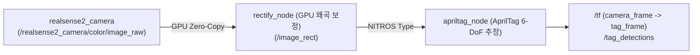

# RBY1 Isaac ROS (`rby1_isaac_ros`)

Rainbow Robotics의 로봇 플랫폼(RBY1 등)에서 NVIDIA Isaac ROS의 하드웨어 가속 비전 노드(`isaac_ros_apriltag`, `isaac_ros_visual_slam`, `isaac_ros_nvblox` 등)를 컨테이너 환경에서 통합 구동하기 위한 예제 및 애플리케이션 개발 레포지토리입니다.

본 레포지토리는 RBY1 특화 예제 노드, 통합 런치 파일, 설정을 관리하며, 대용량 외부 의존성인 NVIDIA 공식 패키지(`isaac_ros_common`, `isaac_ros_apriltag` 등)는 `.gitignore`로 제외되어 호스트 환경 버전에 맞추어 `src/` 경로에 클론하여 사용합니다.

---

## 1. ⚙️ 사전 호스트 환경 구성 (필수 선행)

본 워크스페이스를 구동하기 전, 사용 중인 호스트 OS 버전에 맞는 사전 환경 설정(NVIDIA 드라이버, Docker, Container Toolkit, Buildx, 디바이스 마운트, `isaac_ros_common` 클론 및 검증)을 먼저 완료해야 합니다.

* 📌 **Ubuntu 22.04 LTS (ROS 2 Humble / release-3.2 권장)**:  
  👉 **[docs/env_setup_ubuntu_22_04.md](docs/env_setup_ubuntu_22_04.md)**
* 📌 **Ubuntu 24.04 LTS (ROS 2 Jazzy / release-4.0+ 권장)**:  
  👉 **[docs/env_setup_ubuntu_24_04.md](docs/env_setup_ubuntu_24_04.md)**

---

## 2. 🧩 기본 개발 및 빌드 워크플로우

호스트 설정이 완료되었다면 아래 단계에 따라 필요한 패키지를 구성하고 빌드합니다.

### Step 1. 필요한 Isaac ROS 패키지 클론 (`src/` 경로)
모든 공식 패키지는 NITROS ABI 호환성을 위해 반드시 **동일한 릴리즈 브랜치**로 통일하여 클론합니다.

#### 🔹 Ubuntu 22.04 LTS 호스트 (ROS 2 Humble / release-3.2)
```bash
cd ~/isaac_ros_ws/src

# 1. 도커 개발 래퍼 (환경 구성 단계에서 클론하지 않은 경우)
git clone -b release-3.2 https://github.com/NVIDIA-ISAAC-ROS/isaac_ros_common.git

# 2. 비전 및 AprilTag 패키지
git clone -b release-3.2 https://github.com/NVIDIA-ISAAC-ROS/isaac_ros_apriltag.git
git clone -b release-3.2 https://github.com/NVIDIA-ISAAC-ROS/isaac_ros_image_pipeline.git

# [Visual SLAM 필요 시]
# git clone -b release-3.2 https://github.com/NVIDIA-ISAAC-ROS/isaac_ros_visual_slam.git
```

#### 🔹 Ubuntu 24.04 LTS 호스트 (ROS 2 Jazzy / release-4.0 이상)
```bash
cd ~/isaac_ros_ws/src

# 1. 도커 개발 래퍼 (환경 구성 단계에서 클론하지 않은 경우)
git clone -b release-4.0 https://github.com/NVIDIA-ISAAC-ROS/isaac_ros_common.git

# 2. 비전 및 AprilTag 패키지
git clone -b release-4.0 https://github.com/NVIDIA-ISAAC-ROS/isaac_ros_apriltag.git
git clone -b release-4.0 https://github.com/NVIDIA-ISAAC-ROS/isaac_ros_image_pipeline.git

# [Visual SLAM 필요 시]
# git clone -b release-4.0 https://github.com/NVIDIA-ISAAC-ROS/isaac_ros_visual_slam.git
```

---

### Step 2. [최초 1회 필수] x86_64 PC Dockerfile 사전 패치 확인

> [!IMPORTANT]
> **이 패치는 일반 PC (Ubuntu 22.04 x86_64) 환경에서만 필요합니다.**  
> * **x86_64 PC**: x86 apt 저장소에 없는 Jetson 전용 코덱 패키지(`nvv4l2`)를 설치하려다 `Exit code 100` 에러가 발생하므로 아래 예외 처리가 필수입니다.
> * **Jetson (ARM64 / aarch64)**: JetPack 기본 런타임에 이미 포함되어 있어 **이 패치가 전혀 필요 없으며, 아무 수정 없이 빌드**됩니다.  
> *(참고: `Dockerfile.x86_64`와 `Dockerfile.aarch64`는 모두 `Dockerfile.base`를 가리키는 심볼릭 링크입니다).*

* **대상 파일**: `~/isaac_ros_ws/src/isaac_ros_common/docker/Dockerfile.base` (또는 `Dockerfile.x86_64`)

#### `nvv4l2` 예외 처리 (423번 라인 `extended-amd64` 스테이지 부근)
`release-3.2`에서는 구버전(3.1)에 있던 보안 패키지 버전 고정(`nghttp2` 등) 문제가 이미 해결되었으므로, **x86 PC 빌드 시 아래 423번 라인의 `nvv4l2` 예외 처리 하나만 확인/적용**하시면 됩니다:

```dockerfile
RUN --mount=type=cache,target=/var/cache/apt \
    (apt-get update && apt-get install -y nvv4l2 || true) \
    && (ln -s /usr/lib/x86_64-linux-gnu/libnvcuvid.so.1 /usr/lib/x86_64-linux-gnu/libnvcuvid.so || true) \
    && (ln -s /usr/lib/x86_64-linux-gnu/libnvidia-encode.so.1 /usr/lib/x86_64-linux-gnu/libnvidia-encode.so || true)
```

---

### Step 3. 컨테이너 구동 및 세션 진입

`isaac_ros_common`은 실행 중인 하드웨어(x86 PC 또는 Jetson ARM64)를 자동으로 감지하여 최적의 GPU 가속 컨테이너를 구동합니다.

```bash
# 기본 실행 방식 (호스트 터미널)
cd ~/isaac_ros_ws/src/isaac_ros_common
ISAAC_ROS_WS=$HOME/isaac_ros_ws ./scripts/run_dev.sh
```

#### ⚡ 스마트 단축 커맨드 사용 (`isaac-ros` 권장)
환경 구성 단계에서 `~/.bashrc`에 단축 함수를 등록해 두었다면, 어느 디렉터리에 있든 터미널에서 아래 한 단어로 컨테이너 자동 구동 및 진입(실행 중이면 추가 터미널 자동 접속)이 가능합니다:
```bash
isaac-ros
```
> 실행 완료 시 컨테이너 프롬프트(`admin@<hostname>:/workspaces/isaac_ros-dev$`)로 자동 진입합니다.

---

### Step 4. 컨테이너 내부 의존성 설치 (`rosdep`)
컨테이너 내부에서 패키지가 요구하는 모든 NITROS 및 GXF 가속 라이브러리를 공식 패키지 저장소로부터 자동 해결합니다:

```bash
# 컨테이너 내부에서 실행
cd /workspaces/isaac_ros-dev

# 1. rosdep을 통한 Isaac ROS 핵심 의존성(NITROS 등) 일괄 설치
sudo apt update
rosdep update
rosdep install --from-paths src --ignore-src -r -y

# 2. 센서 드라이버 설치 (RealSense 사용 시)
# Ubuntu 22.04 (Humble):
sudo apt install -y ros-humble-realsense2-camera ros-humble-isaac-ros-realsense
# Ubuntu 24.04 (Jazzy):
# sudo apt install -y ros-jazzy-realsense2-camera
```

---

### Step 5. 패키지 빌드 (`colcon build`)
빌드 시간을 단축하기 위해 현재 작업 중인 패키지 단위로 빌드합니다:

```bash
# 컨테이너 내부에서 실행
# AprilTag 패키지 빌드
colcon build --symlink-install --packages-up-to isaac_ros_apriltag

# 빌드 환경 반영 (오버레이 적용)
source /opt/ros/humble/setup.bash             # Jazzy의 경우 /opt/ros/jazzy/setup.bash
source /workspaces/isaac_ros-dev/install/setup.bash
```

---

## 3. 🚀 패키지 실행 및 검증 예시: RealSense + AprilTag 3D 추적

Isaac ROS 노드는 Zero-Copy GPU 데이터 전송을 극대화하기 위해 독립 바이너리가 아닌 **Composable Node Component** 형태로 동작하므로, 런치(`launch.py`) 파일을 통해 컨테이너에 결합하여 실행합니다.



### 3.1. 런치 파일 설정 (`isaac_ros_apriltag_realsense.launch.py`)
* **위치**: `~/isaac_ros_ws/src/isaac_ros_apriltag/isaac_ros_apriltag/launch/isaac_ros_apriltag_realsense.launch.py`
* **주요 파라미터**:
  * 마커 크기 (`size`): 실제 태그의 한 변 길이 (단위: 미터, 예: 8cm $\rightarrow$ `0.08`)
  * 해상도: `1280x720` (카메라 및 Rectify 노드 일치)

### 3.2. 런치 실행 (컨테이너 내부)
```bash
source /opt/ros/humble/setup.bash
source /workspaces/isaac_ros-dev/install/setup.bash
ros2 launch isaac_ros_apriltag isaac_ros_apriltag_realsense.launch.py
```

### 3.3. 호스트에서 결과 모니터링
새 호스트 터미널에서 TF 변환 및 영상을 확인합니다:
```bash
# 1. 3D 좌표 변환(TF) 출력 확인
ros2 run tf2_ros tf2_echo camera_color_optical_frame tag36h11:0

# 2. RViz2 시각화
rviz2
```
* **RViz2 디스플레이 설정**:
  * `Fixed Frame`: `camera_color_optical_frame`
  * `Add` $\rightarrow$ `Image` (Topic: `/image_rect`)
  * `Add` $\rightarrow$ `TF` (카메라 기준 마커 3D 축 확인)

---

## 4. 🛠️ 컨테이너 세션 관리 치트시트

* **멀티 터미널 추가 접속 (호스트 터미널에서 실행)**:
  컨테이너가 실행 중인 상태에서 새 터미널 창을 열고 `isaac-ros`를 입력하면 자동으로 실행 중인 컨테이너에 attach됩니다:
  ```bash
  isaac-ros
  # 또는 직접 명령어: docker exec -it isaac_ros_dev-x86_64-container bash
  ```
* **세션 종료**: 컨테이너 셸에서 `exit`
* **컨테이너 강제 중지**: `docker stop isaac_ros_dev-x86_64-container`
* **💡 의존성 보존 팁**:
  * `run_dev.sh`는 `--rm` 플래그로 동작하므로 컨테이너를 껐다 켜면 `apt-get`으로 설치한 바이너리는 초기화됩니다.
  * 단, `/workspaces/isaac_ros-dev`에 저장된 `src/`, `build/`, `install/` 산출물은 호스트 디스크에 영구 보존되므로, 재진입 시 `rosdep install`만 한 번 다시 수행하면 이전 빌드 결과를 즉시 로드할 수 있습니다.
