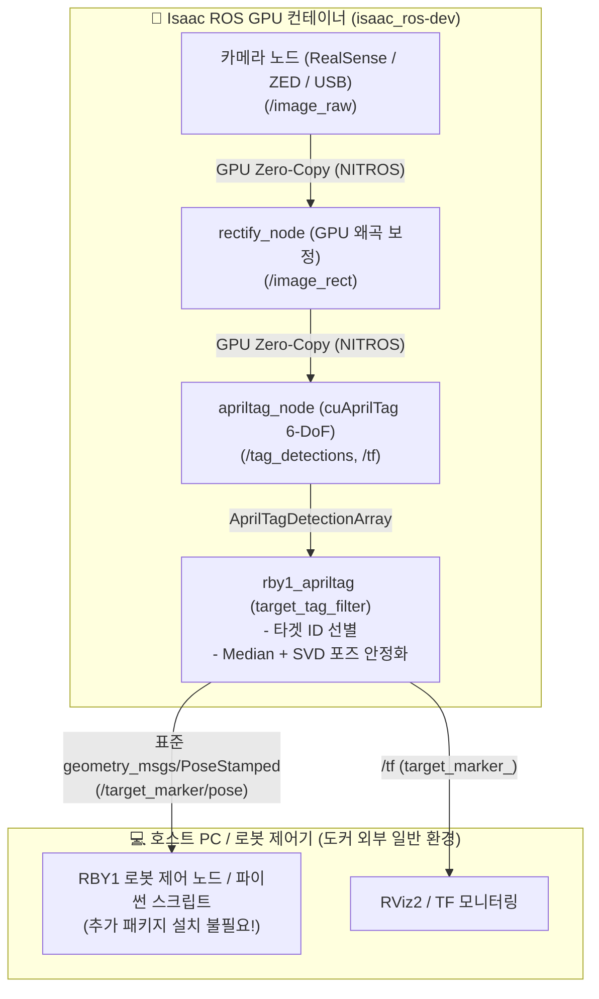

# 🎯 Isaac ROS AprilTag 실전 가이드 & 애플리케이션 개발 매뉴얼 (`tutorial_apriltag.md`)

NVIDIA GPU 가속 비전 라이브러리(`cuAprilTag`, `NITROS`)를 활용하여 고성능 6-DoF 마커 추적 파이프라인을 구축하고, RBY1 로봇 애플리케이션 연동을 위한 타겟 마커 선별 및 포즈 안정화 패키지(`rby1_apriltag`)를 활용하는 종합 개발 매뉴얼입니다.

---

## 1. 🏗️ 시스템 아키텍처 및 GPU 파이프라인

Isaac ROS AprilTag는 GPU 메모리 상에서 직접 연산되는 Zero-Copy 전송(`NITROS`)을 극대화하기 위해 독립 프로세스가 아닌 **Composable Node** 형태로 단일 컨테이너(`component_container_mt`) 내에 로드되어 구동됩니다.

검출된 모든 마커 좌표는 응용 패키지(`rby1_apriltag`)를 통해 특정 타겟 ID만 선별되고 순방향 행렬 필터링을 거쳐, **도커 외부의 로봇 제어기나 호스트 애플리케이션이 추가 설치 없이 즉시 사용할 수 있는 표준 ROS 2 토픽(`PoseStamped`) 및 TF로 발행**됩니다.



---

## 2. 📷 센서별 파이프라인 구성 및 파라미터 가이드

### 2.1. RealSense 제품군별 설정 (D405 vs D435 vs D455)

모든 RealSense 제품군은 동일한 드라이버(`realsense2_camera`)를 사용하지만, 광학계와 센서 구조에 따라 적용해야 하는 파라미터 경로 및 최적 해상도가 다릅니다.

| 카메라 모델 | 광학계 및 센서 구조 | 해상도 / FPS 설정 파라미터 | 권장 설정값 | 센서 특성 및 팁 |
| :--- | :--- | :--- | :--- | :--- |
| **D405** | 서브밀리미터 매크로<br/>(Stereo RGB 일체형) | `depth_module.color_profile` | `'1280x720x30'`<br/>*(고속: `'848x480x60'`)* | 독립 RGB 센서가 없으므로 `depth_module` 설정을 따름. 1080p 미지원. 7~50cm 근거리 정밀 작업에 최적. |
| **D435 / D435i** | 독립 RGB 센서 +<br/>Stereo Depth | `rgb_camera.color_profile` | `'1920x1080x30'`<br/>`'1280x720x30'` | 범용 표준 센서. 1080p, 720p, 848x480(60/90fps) 지원. D435i는 IMU 내장. |
| **D455** | 글로벌 셔터 RGB +<br/>광시야각(FOV) | `rgb_camera.color_profile` | `'1280x800x30'`<br/>`'848x480x60'` | RGB 화각이 넓어 로봇 이동 시 마커 추적에 최적. 1280x800(16:10) 기본 비율 지원. |

> **⚠️ 파라미터 적용 주의**: D405 모델은 `rgb_camera.color_profile`을 설정하면 무시되므로 반드시 `depth_module.color_profile`을 사용해야 합니다.

---

### 2.2. 초고속 마커 트래킹 설정 (848x480 @ 60~90 FPS)

`cuAprilTag` 알고리즘은 NVIDIA RTX GPU 기준 검출 시간이 약 **0.8ms(1,000 FPS 이상)**에 불과하므로, 센서가 지원하는 최대 FPS로 병목 없이 구동할 수 있습니다. 로봇 팔의 고속 핸드-아이 트래킹이나 빠른 모바일 베이스 주행 시 아래와 같이 해상도를 낮추고 FPS를 높입니다.

* **설정 방법**:
  1. `rectify_node`의 출력 해상도를 `848x480`으로 변경
  2. `realsense2_camera`의 컬러 프로필을 `848x480x60` (또는 `848x480x90`)으로 지정

```python
# 1. GPU 왜곡 보정 해상도 변경
ComposableNode(
    package='isaac_ros_image_proc',
    plugin='nvidia::isaac_ros::image_proc::RectifyNode',
    name='rectify',
    parameters=[{
        'output_width': 848,
        'output_height': 480,
    }],
    remappings=[
        ('image_raw', '/realsense2_camera/color/image_raw'),
        ('camera_info', '/realsense2_camera/color/camera_info'),
    ]
),

# 2. 카메라 컬러 프로필 고속 모드 적용
ComposableNode(
    package='realsense2_camera',
    plugin='realsense2_camera::RealSenseNodeFactory',
    name='realsense2_camera',
    parameters=[{
        'depth_module.color_profile': '848x480x60',  # D405
        'rgb_camera.color_profile': '848x480x60',    # D435/D455
        'enable_depth': False,                       # 대역폭 확보를 위해 Depth OFF
        'enable_color': True,
    }]
)
```

---

### 2.3. Stereolabs ZED 카메라 직결 파이프라인 (Rectify 생략)

ZED 카메라(ZED 2, ZED 2i, ZED X, ZED Mini)는 카메라 내부 공장 캘리브레이션 데이터를 기반으로 드라이버(`zed_wrapper`) 내부 GPU에서 이미 완벽히 왜곡 보정된 이미지(`/zed/zed_node/rgb/image_rect_color`)를 발행합니다.

* **장점**: 별도의 `rectify_node`를 둘 필요 없이 **AprilTag 노드로 직접 연결**되므로 GPU 메모리와 파이프라인 지연(Latency)이 크게 절약됩니다.

```python
# ZED 카메라와 cuAprilTag 직결 예시
ComposableNode(
    package='isaac_ros_apriltag',
    plugin='nvidia::isaac_ros::apriltag::AprilTagNode',
    name='apriltag',
    parameters=[{
        'size': 0.08,
        'max_tags': 64,
        'tag_family': 'tag36h11',
    }],
    remappings=[
        ('image', '/zed/zed_node/rgb/image_rect_color'),
        ('camera_info', '/zed/zed_node/rgb/camera_info'),
    ]
)
```

---

### 2.4. 일반 USB 웹캠 파이프라인 (`v4l2_camera` + 캘리브레이션)

C920, Brio 등 일반 USB 웹캠을 사용하는 경우 왜곡이 보정되어 있지 않으므로 다음 단계가 필수적입니다:

1. **드라이버 설치**:
   ```bash
   sudo apt install -y ros-humble-v4l2-camera ros-humble-camera-calibration
   ```
2. **카메라 캘리브레이션**: 체커보드를 사용하여 렌즈 왜곡 계수를 측정한 후 생성된 `ost.yaml` 파일을 드라이버에 `camera_info_url` 파라미터로 로드합니다.
3. **파이프라인 구성**: `v4l2_camera` $\rightarrow$ `rectify_node` $\rightarrow$ `apriltag_node`

---

## 3. ⚙️ Isaac ROS AprilTag 기본 런치 및 실행

### 3.1. 런치 파일 (`isaac_ros_apriltag_realsense.launch.py`)

* **파일 위치**: `~/isaac_ros_ws/src/isaac_ros_apriltag/isaac_ros_apriltag/launch/isaac_ros_apriltag_realsense.launch.py`

#### 핵심 파라미터 및 리매핑 상세 표

| 노드 (컴포넌트) | 파라미터 / 리매핑 항목 | 기본 설정값 | 상세 설명 및 설정 가이드 |
| :--- | :--- | :--- | :--- |
| **`rectify_node`**<br/>*(GPU 왜곡 보정)* | `output_width`<br/>`output_height` | `1280`<br/>`720` | 카메라의 입력 해상도와 일치시킵니다. (D405: 1280x720 권장, 고속: 848x480) |
| | `remappings` | `image_raw` $\rightarrow$ `/realsense2_camera/color/image_raw`<br/>`camera_info` $\rightarrow$ `/realsense2_camera/color/camera_info` | 카메라 드라이버의 원본 컬러 영상 및 캘리브레이션 토픽 연결. |
| **`apriltag_node`**<br/>*(cuAprilTag 검출)* | `size` | `0.08` | **실제 마커 한 변의 물리적 길이 (단위: 미터)**.<br/>⚠️ 실제 마커 크기(예: 8cm $\rightarrow$ `0.08`, 5cm $\rightarrow$ `0.05`)와 다르면 3D 거리(Z축 depth)에 비례 오차가 발생합니다. |
| | `tag_family` | `'tag36h11'` | 마커 패밀리 종류 (기본값: `'tag36h11'`, 그 외 `'tag16h5'`, `'tag25h9'` 등 지원). |
| | `max_tags` | `64` | 한 프레임에서 동시에 추적할 수 있는 최대 마커 개수. |
| | `remappings` | `image` $\rightarrow$ `/image_rect`<br/>`camera_info` $\rightarrow$ `/camera_info_rect` | GPU에서 왜곡 보정된 NITROS Zero-Copy 스트림 직결. |
| **`realsense_camera_node`**<br/>*(카메라 드라이버)* | `depth_module.color_profile`<br/>`rgb_camera.color_profile` | `'1280x720x30'` | 컬러 센서 해상도 및 FPS 지정. |
| | `enable_depth`<br/>`enable_infra1, 2` | `False` | 불필요한 깊이/적외선 센서를 꺼서 USB 대역폭 및 CPU 부하 절감. |
| | `enable_color` | `True` | 컬러 RGB 스트림 활성화. |

#### 런치 파일 코드 전문

```python
import launch
from launch_ros.actions import ComposableNodeContainer
from launch_ros.descriptions import ComposableNode


def generate_launch_description():
    # 1. GPU 왜곡 보정 노드 (D405 1280x720)
    rectify_node = ComposableNode(
        package='isaac_ros_image_proc',
        plugin='nvidia::isaac_ros::image_proc::RectifyNode',
        name='rectify',
        namespace='',
        parameters=[{
            'output_width': 1280,
            'output_height': 720,
        }],
        remappings=[
            ('image_raw', '/realsense2_camera/color/image_raw'),
            ('camera_info', '/realsense2_camera/color/camera_info'),
        ]
    )

    # 2. AprilTag 6-DoF 포즈 추정 노드 (Zero-Copy GPU 스트림)
    apriltag_node = ComposableNode(
        package='isaac_ros_apriltag',
        plugin='nvidia::isaac_ros::apriltag::AprilTagNode',
        name='apriltag',
        namespace='',
        parameters=[{
            'size': 0.08,        # 실제 마커 한 변 길이 (미터)
            'max_tags': 64,
            'tag_family': 'tag36h11',
        }],
        remappings=[
            ('image', '/image_rect'),
            ('camera_info', '/camera_info_rect'),
        ]
    )

    # 3. RealSense 카메라 노드
    realsense_camera_node = ComposableNode(
        package='realsense2_camera',
        plugin='realsense2_camera::RealSenseNodeFactory',
        name='realsense2_camera',
        namespace='',
        parameters=[{
            'depth_module.color_profile': '1280x720x30',
            'rgb_camera.color_profile': '1280x720x30',
            'enable_infra1': False,
            'enable_infra2': False,
            'enable_depth': False,
            'enable_color': True,
        }]
    )

    apriltag_container = ComposableNodeContainer(
        package='rclcpp_components',
        name='apriltag_container',
        namespace='',
        executable='component_container_mt',
        composable_node_descriptions=[
            rectify_node,
            apriltag_node,
            realsense_camera_node
        ],
        output='screen'
    )

    return launch.LaunchDescription([apriltag_container])
```

---

### 3.2. 컨테이너 내부 실행

```bash
# 도커 컨테이너 내부에서 실행
source /opt/ros/humble/setup.bash
source /workspaces/isaac_ros-dev/install/setup.bash

ros2 launch isaac_ros_apriltag isaac_ros_apriltag_realsense.launch.py
```

---

### 3.3. 호스트 PC에서 직접 모니터링 및 RViz2 시각화

도커 컨테이너에 들어가지 않고, **호스트 일반 터미널**에서 아래 명령으로 마커 좌표와 RViz2 화면을 직접 확인합니다:

```bash
# 1. 3D 좌표 변환(TF) 실시간 수치 확인 (예: 7번 태그)
ros2 run tf2_ros tf2_echo camera_color_optical_frame tag36h11:7

# 2. RViz2 3D 시각화
rviz2
```

* **RViz2 권장 설정**:
  * `Fixed Frame`: `camera_color_optical_frame`
  * `TF` Display 추가 $\rightarrow$ 마커의 6-DoF 축(RGB) 표시 확인
  * `Image` Display 추가 (Topic: `/image_rect`) $\rightarrow$ 왜곡 보정된 영상 스트림 확인

---

## 4. 🎯 [응용 패키지] 타겟 마커 선별 및 포즈 안정화 (`rby1_apriltag`)

기본 `cuAprilTag` 노드는 시야 내 모든 마커를 검출하고 NVIDIA 독자 메시지(`/tag_detections`)를 발행합니다. 하지만 실제 RBY1 로봇 작업(도킹, 특정 작업대 정렬 등)에서는 **내가 지정한 특정 마커만 선별**해야 하며, 원거리에서 발생하는 **마커 좌표 흔들림(Jitter)을 제거**해야 합니다.

이를 위해 본 워크스페이스에 응용 패키지 **`rby1_apriltag`**가 구현되어 있습니다.

---

### 4.1. 마커 지터(Jitter) 발생 원인 및 안정화 원리

마커 기반 트래킹에서 카메라와 마커의 거리가 멀어질수록($Z \ge 0.5\text{m}$) X, Y 좌표가 심하게 튀는 현상이 발생합니다.

* **원인 (Matrix Inversion Amplification)**:
  * 마커 좌표계를 로봇 베이스 좌표계 등으로 역변환($T^{-1}$)할 때, 역변환 행렬의 위치 성분은 $-R^T t$가 됩니다.
  * 회전각의 미세한 노이즈(0.5° 미만)가 큰 깊이($Z$) 벡터와 곱해지면서 **X, Y 방향의 수평 오차가 수 센티미터 단위로 증폭**됩니다.
  * 역변환된 행렬들을 평균화하면 이미 왜곡된 값이 섞여 지터가 더 악화됩니다.
* **해결 원리 (Average Before Inversion)**:
  1. **순방향 행렬 수집**: 카메라 기준 마커 변환 행렬($^{Camera}T_{Marker}$) 상태에서 슬라이딩 윈도우 버퍼에 수집합니다.
  2. **Robust Median Translation**: 위치($X, Y, Z$) 성분은 이상치에 강인한 **중앙값(Median)**으로 필터링합니다.
  3. **SVD 직교 회전 평균화**: 회전 행렬 합산치에 특이값 분해(SVD)를 적용하여 직교 회전 행렬($R_{avg} = U V^T$)을 산출합니다.
  4. 이를 통해 각도 노이즈가 $Z$ 깊이에 곱해져 증폭되기 전에 완벽히 스무딩됩니다.

---

### 4.2. `rby1_apriltag` 패키지 구성 및 설정 파일

* **패키지 위치**: `src/rby1_isaac_ros/rby1_apriltag`
* **설정 파일 (`config/target_tags.yaml`)**:

```yaml
target_tag_filter:
  ros__parameters:
    target_ids: [7]                      # 추적할 마커 ID 화이트리스트 (복수 ID 지정 가능: [7, 0, 12])
    input_topic: "/tag_detections"        # Isaac ROS cuAprilTag 원본 토픽
    output_pose_topic: "/target_marker/pose" # 표준 ROS 2 PoseStamped 토픽
    broadcast_tf: true                    # 필터링된 마커 TF 브로드캐스트 활성화
    target_frame_prefix: "target_marker"  # TF child_frame 접두사 (예: target_marker_7)
    filter_jitter: true                   # 순방향 행렬 Median+SVD 포즈 안정화 적용
    window_size: 5                        # 평활화 슬라이딩 윈도우 크기 (프레임)
    publish_per_tag_topics: true          # /target_marker_<id>/pose 토픽 개별 발행 여부
```

---

### 4.3. 빌드 및 실행 매뉴얼

#### Step 1. 패키지 빌드 (컨테이너 내부)
```bash
# 도커 컨테이너 내부 터미널
cd /workspaces/isaac_ros-dev
colcon build --symlink-install --packages-select rby1_apriltag
source install/setup.bash
```

#### Step 2. Isaac ROS + 타겟 필터 노드 실행
* **터미널 1 (Isaac ROS AprilTag 파이프라인)**:
  ```bash
  source /opt/ros/humble/setup.bash
  source /workspaces/isaac_ros-dev/install/setup.bash
  ros2 launch isaac_ros_apriltag isaac_ros_apriltag_realsense.launch.py
  ```

* **터미널 2 (타겟 마커 선별 & 포즈 안정화 노드)**:
  ```bash
  # 컨테이너에 추가 터미널로 접속
  isaac-ros

  # 타겟 필터 노드 실행 (기본 7번 태그 추적)
  source /opt/ros/humble/setup.bash
  source /workspaces/isaac_ros-dev/install/setup.bash
  ros2 launch rby1_apriltag target_tag_filter.launch.py
  ```

---

## 5. 🌐 도커 외부(호스트 PC / 로봇 제어기) 통신 및 연동 가이드

많은 사용자가 **"도커 밖에서 토픽을 받으려면 호스트 환경에 무엇을 추가로 설치해야 하는가?"**에 대해 혼란을 겪습니다. 아래 가이드를 통해 호스트 환경 구성을 정확히 이해할 수 있습니다.

### 5.1. ROS 2 DDS 네트워크 통신 환경

Isaac ROS 컨테이너는 호스트와 동일한 네트워크 스택(`--net=host`) 및 공유 메모리(`--ipc=host`)를 공유하므로 별도의 포트 포워딩 없이 호스트와 ROS 2 통신이 직결됩니다.

* **필수 일치 항목**:
  1. `ROS_DOMAIN_ID`: 도커 내부와 호스트 터미널의 `ROS_DOMAIN_ID`가 동일해야 합니다 (기본값: `0`).
     ```bash
     echo $ROS_DOMAIN_ID  # 호스트와 컨테이너 둘 다 확인
     ```
  2. `RMW_IMPLEMENTATION`: 기본적으로 둘 다 `rmw_fastrtps_cpp`로 설정되어 있으므로 별도 변경 없이 호환됩니다.
  3. `ROS_LOCALHOST_ONLY`: 외부 장비와 통신하지 않는 한 기본값(해제 상태)을 유지합니다.

---

### 5.2. 토픽별 의존성 및 호스트 설치 요구사항 비교

| 토픽 및 데이터 | 메시지 타입 | 호스트 PC 추가 설치 필요 여부 | 설명 |
| :--- | :--- | :--- | :--- |
| **`/target_marker/pose`**<br/>(권장) | `geometry_msgs/msg/PoseStamped` | **설치 필요 없음 (0개)** | ROS 2 기본 표준 인터페이스이므로 호스트의 Python, C++, RBY1 제어 노드가 기본 환경에서 즉시 구독 가능합니다. |
| **`/tf` (`target_marker_7`)**<br/>(권장) | `tf2_msgs/msg/TFMessage` | **설치 필요 없음 (0개)** | ROS 2 표준 TF 라이브러리(`tf2_ros`)로 `camera` $\rightarrow$ `target_marker_7` 좌표를 즉시 변환 및 조회 가능합니다. |
| **`/tag_detections`**<br/>(Isaac ROS 원본) | `isaac_ros_apriltag_interfaces/<br/>AprilTagDetectionArray` | ⚠️ **인터페이스 패키지 필요** | NVIDIA 독자 규격이므로 호스트에서 직접 구독하려면 호스트 워크스페이스에 `isaac_ros_apriltag_interfaces`가 빌드되어 있어야 합니다. |

> **💡 설계 권장 사항 (Best Practice)**:  
> 도커 외부(호스트 PC, RBY1 로봇 SDK, 내비게이션 노드 등)에서는 독자 규격인 `/tag_detections` 대신, `rby1_apriltag`가 정제하여 발행하는 **표준 토픽 `/target_marker/pose`** 및 **`/tf`**를 구독하는 것이 가장 안정적이며 호스트 환경의 의존성을 완벽하게 제로(Zero)로 유지할 수 있습니다.

---

### 5.3. 호스트 환경 파이썬 구독 및 로봇 연동 예제 (추가 설치 0개)

도커 외부 호스트 PC 터미널에서 실행되는 순수 ROS 2 파이썬 스크립트 예제입니다. Isaac ROS 패키지를 전혀 참조하지 않고 오직 표준 `geometry_msgs`와 `tf2_ros`만으로 동작합니다.

```python
#!/usr/bin/env python3
# host_target_listener.py
# 실행 위치: 도커 진입 불필요! 호스트 일반 터미널에서 바로 실행 가능!
import rclpy
from rclpy.node import Node
from geometry_msgs.msg import PoseStamped
import tf2_ros

class HostTargetListener(Node):
    def __init__(self):
        super().__init__('host_target_listener')
        
        # 1. 표준 PoseStamped 구독
        self.sub_pose = self.create_subscription(
            PoseStamped,
            '/target_marker/pose',
            self.pose_callback,
            10
        )
        
        # 2. TF 버퍼 리스너 (원하는 기준 프레임으로 좌표 조회 가능)
        self.tf_buffer = tf2_ros.Buffer()
        self.tf_listener = tf2_ros.TransformListener(self.tf_buffer, self)
        
        self.get_logger().info("호스트 타겟 마커 리스너 시작됨 (/target_marker/pose 대기 중)...")

    def pose_callback(self, msg: PoseStamped):
        pos = msg.pose.position
        ori = msg.pose.orientation
        self.get_logger().info(
            f"🎯 [마커 감지] 위치: X={pos.x:.3f}m, Y={pos.y:.3f}m, Z={pos.z:.3f}m | "
            f"자세: Qx={ori.x:.3f}, Qy={ori.y:.3f}, Qz={ori.z:.3f}, Qw={ori.w:.3f}"
        )

def main():
    rclpy.init()
    node = HostTargetListener()
    try:
        rclpy.spin(node)
    except KeyboardInterrupt:
        pass
    finally:
        node.destroy_node()
        rclpy.shutdown()

if __name__ == '__main__':
    main()
```

* **호스트 터미널 실행 방법**:
  ```bash
  source /opt/ros/humble/setup.bash
  python3 host_target_listener.py
  ```

---

## 6. 🛠️ 트러블슈팅 및 튜닝 체크리스트

| 증상 / 이슈 | 점검 및 해결 방법 |
| :--- | :--- |
| **마커 크기(Z축 거리) 오차** | 마커의 한 변 길이를 자로 정밀 측정하여 `apriltag_node`의 `size` 파라미터(단위: 미터)와 반드시 일치시키십시오. (예: 80mm $\rightarrow$ `0.08`) |
| **도커 외부에서 토픽이 안 보임** | 1. 호스트와 컨테이너 둘 다 `echo $ROS_DOMAIN_ID`를 확인하여 번호가 같은지 확인합니다.<br/>2. 방화벽(`ufw`)이 DDS 멀티캐스트 UDP 트래픽을 차단하고 있는지 확인합니다 (`sudo ufw status`). |
| **호스트에서 `ros2 topic echo /tag_detections` 시 에러** | `/tag_detections`는 NVIDIA 독자 규격 메시지입니다. 호스트에서는 표준 토픽인 `ros2 topic echo /target_marker/pose` 또는 `ros2 run tf2_ros tf2_echo ...`를 사용하십시오. |
| **원거리 마커 떨림 (Jitter)** | `rby1_apriltag`의 `config/target_tags.yaml`에서 `filter_jitter: true`를 유지하고 필요 시 `window_size`를 `5`에서 `8`~`10`으로 상향하십시오. |
| **카메라 프레임 레이트 저하** | RealSense 드라이버 설정에서 `enable_depth: False`, `enable_infra1: False`, `enable_infra2: False`로 설정하여 USB 3.0 대역폭을 오직 RGB 스트림에만 집중시키십시오. |
