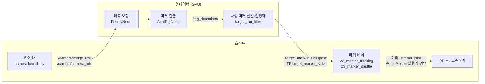

# RB-Y1 AprilTag 사용 가이드

카메라 영상에서 AprilTag 마커를 GPU로 찾아, 지정한 마커의 자세를 표준 ROS 토픽과 TF로 내보냅니다. 카메라는 호스트에서
켜고 영상만 컨테이너로 넘깁니다. 그 좌표로 손이나 머리가 마커를 따라가게 하는 예제는 §3.4에 있습니다.


```mermaid
flowchart LR
    subgraph host["호스트"]
        camera["카메라<br/>camera.launch.py"]
        driver["RB-Y1 드라이버"]
        tracker["마커 예제<br/>22_marker_tracking<br/>23_marker_shuttle"]
    end
    subgraph container["컨테이너 (GPU)"]
        rectify["왜곡 보정<br/>RectifyNode"]
        apriltag["마커 검출<br/>AprilTagNode"]
        filter["대상 마커 선별·안정화<br/>target_tag_filter"]
    end
    camera -->|"/camera/image_raw<br/>/camera/camera_info"| rectify
    rectify --> apriltag
    apriltag -->|"/tag_detections"| filter
    filter -->|"/target_marker_&lt;id&gt;/pose<br/>TF target_marker_&lt;id&gt;"| tracker
    tracker -->|"머리: stream_joint<br/>손: cuMotion 실행기 경유"| driver
```

**위에서 아래로 순서대로 따라 하면 됩니다.** 문제가 생기면 그 터미널에 나오는 메시지가 원인과 할 일을 알려 줍니다.
더 자세한 원인은 [developer_manual.md의 트러블슈팅](developer_manual.md#12-트러블슈팅)에 있습니다.

> ⚠️ 시뮬레이터와 합성 마커 영상으로 확인한 절차입니다. 실제 카메라는 영상이 컨테이너까지 넘어가는 것만 확인했고(RealSense D405), 실제 마커·로봇으로는 아직 돌려 보지 않았습니다.

### 한눈에 보기

```bash
# 터미널1 : 호스트
ros2 launch rby1_driver rby1_ros2_driver.launch.py                  # 드라이버 (로봇을 움직일 때)
# 터미널2 : 호스트
ros2 launch rby1_additional_tools camera.launch.py                  # 카메라 → 토픽
# 터미널3 : 컨테이너 (isaac-ros)
ros2 launch rby1_apriltag apriltag.launch.py                        # 마커 검출 → /target_marker/pose
# 터미널4 : 호스트
ros2 run rby1_examples 22_marker_tracking --ros-args -p follow:=head  # 머리가 마커를 따라감 (§3.4)
```

---

## 1. 준비물

| 항목 | 값 |
|---|---|
| 환경 | [tutorial_cumotion.md 1. 준비물](tutorial_cumotion.md#1-준비물)과 같음 (GPU, Docker, `isaac-ros`, 드라이버 워크스페이스) |
| 카메라 | USB 웹캠, 또는 RealSense(호스트에 `sudo apt install ros-humble-librealsense2` 뒤 `rby1_additional_tools` 빌드, realsense-ros는 필요 없음) — 호스트에 연결 |
| 마커 | `tag36h11` 패밀리 인쇄물. 검은 사각형 한 변 길이를 자로 재 둡니다(→ 설정 파일의 `size`). 여러 개를 쓰면 모두 같은 크기로 인쇄합니다. 이미지: [apriltag-imgs/tag36h11](https://github.com/AprilRobotics/apriltag-imgs/tree/master/tag36h11) |

> 호스트와 컨테이너의 `ROS_DOMAIN_ID`가 같아야 합니다(둘 다 설정하지 않았다면 이미 같습니다).

---

## 2. 설치 (처음 한 번)

### 2.1. 이미지 — 호스트

cuMotion과 같은 이미지를 씁니다. [tutorial_cumotion.md 2.1](tutorial_cumotion.md#21-이미지-만들기--호스트)대로 만들었다면
AprilTag 패키지(`isaac_ros_apriltag`, `isaac_ros_image_proc`)가 이미 들어 있습니다.

### 2.2. 패키지 빌드 — 컨테이너

```bash
cd /workspaces/isaac_ros-dev
colcon build --symlink-install --base-paths src/rby1_isaac_ros/rby1_apriltag --packages-select rby1_apriltag
```

이후 컨테이너에 들어올 때마다 자동으로 source됩니다.

`--symlink-install`로 빌드해야 `config/target_tags.yaml`을 고친 것이 **런치를 다시 띄우는 것만으로** 적용됩니다(없이 빌드하면
설치 폴더에 복사본이 남아, 고친 뒤 다시 빌드해야 합니다). 예전에 이 옵션 없이 빌드했다면 먼저
`rm -rf build/rby1_apriltag install/rby1_apriltag`를 합니다.

---

## 3. 실행 (매번)

| 터미널 | 위치 | 하는 일 |
|---|---|---|
| 1 | 호스트 | 드라이버 (로봇을 움직일 때. 시뮬레이터면 [tutorial_cumotion.md 3.1](tutorial_cumotion.md#31-시뮬레이터--터미널-1)도) |
| 2 | 호스트 | 카메라 |
| 3 | 컨테이너 | 마커 검출 |
| 4 | 호스트 | 확인, 마커 예제 |

호스트 터미널에서는 먼저 `source ~/ros2_driver_ws/install/setup.bash`를 합니다.

### 3.1. 카메라 — 터미널 2

```bash
ros2 launch rby1_additional_tools camera.launch.py                          # 웹캠 /dev/video0, 1280×720
ros2 launch rby1_additional_tools camera.launch.py source:=/dev/video2      # 다른 웹캠
ros2 launch rby1_additional_tools camera.launch.py camera:=realsense        # RealSense (컬러만)
ros2 launch rby1_additional_tools camera.launch.py camera:=file source:=/경로/tag.png   # 카메라 없이 이미지로
```

설정(해상도, fps, 노출, 토픽, RealSense의 깊이·적외선 켜기)은 `rby1_additional_tools/config/webcam.yaml`,
`config/realsense.yaml`에 있습니다. 고친 파일은 `config:=/경로/my.yaml`로 씁니다.

보정값(내부 파라미터)이 있으면 붙입니다. camera_ws의 `camera_intrinsics_*.yaml`을 그대로 쓸 수 있습니다:

```bash
ros2 launch rby1_additional_tools camera.launch.py camera:=realsense intrinsics:=/경로/camera_intrinsics_d435.yaml
```

없으면 RealSense는 공장 보정값을, 웹캠은 화각(`horizontal_fov`)으로 만든 근사 모델을 씁니다(마커 거리가 대략값).
카메라가 머리에 붙은 위치는 `rby1_additional_tools/config/camera_mount.yaml`(기본: `link_head_2`에서 앞 22 mm, 위 40 mm)입니다.
다르면 재서 고칩니다. 설정 전체는 드라이버 저장소 README의 **Additional Tools**에 있습니다.

> 카메라나 보정값을 바꾸면 3.2(마커 검출)도 다시 켭니다. 컨테이너의 보정 노드가 처음 받은 카메라 모델을 계속 씁니다.

### 3.2. 마커 검출 — 터미널 3 (컨테이너)

```bash
isaac-ros
ros2 launch rby1_apriltag apriltag.launch.py
ros2 launch rby1_apriltag apriltag.launch.py ids:=7,12 size:=0.08      # 마커 번호·크기를 이번만 바꿔서
```

마커 설정은 `rby1_apriltag/config/target_tags.yaml`에 있습니다(6. 설정). **먼저 `size`를 인쇄한 마커에 맞춥니다.**

- `size`: 마커 검은 사각형 한 변(m, 기본 `0.10`). 마커의 3차원 자세는 이 크기와 카메라 보정값으로 영상 한 장에서
  계산합니다(깊이 영상은 쓰지 않습니다). 그래서 틀리면 거리가 그 비율만큼 틀립니다.
- `target_ids`: 찾을 마커 번호(기본 `[7]`).
- 런치 인자 `size:=`, `tag_family:=`, `ids:=`(쉼표로 구분)를 주면 그 실행에서만 설정 파일 값을 덮어씁니다.
- 설정 파일을 고쳤으면 이 런치를 **다시 띄워야** 적용됩니다. 시작할 때 나오는 `markers: …` 줄에서 실제로 쓰는 크기·번호와
  읽은 파일을 확인합니다.
- 카메라 해상도가 1280×720이 아니면 `width:=… height:=…`로 맞춥니다.

아래가 나오면 됩니다:

```
markers: tag36h11, black square 0.1 m, target ids [7] (settings: …/rby1_apriltag/config/target_tags.yaml)
[target_tag_filter] target ids [7] from /tag_detections; smoothing over 5 frames
```


### 3.3. 확인 — 터미널 4

마커를 카메라 앞에 둡니다.

```bash
ros2 topic echo /target_marker/pose --once        # frame_id: camera_optical_frame, position.z = 카메라에서 거리(m)
ros2 topic hz /target_marker/pose                 # 카메라 fps 정도
ros2 run tf2_ros tf2_echo link_head_2 target_marker_7
```

**화면으로 보기 (RViz)** — 카메라를 켤 때(3.1) `rviz:=true`를 붙이면 RViz가 같이 뜹니다.

```bash
ros2 launch rby1_additional_tools camera.launch.py rviz:=true                    # 웹캠
ros2 launch rby1_additional_tools camera.launch.py camera:=realsense rviz:=true  # RealSense
```

| RViz 창 | 보이는 것 |
|---|---|
| Camera image | 카메라 영상(`/camera/image_raw`) |
| Marker view | 같은 영상 위에 좌표축을 겹쳐 그림 — 마커를 찾으면 **마커 위에 축**(`target_marker_<id>`)이 얹힙니다 |
| 3D 화면 | 카메라(`camera_link`)와 마커의 위치 관계. `tag36h11:<id>`는 찾은 모든 마커, `target_marker_<id>`는 대상 마커 |

마커 검출(3.2)을 켜기 전에는 영상만 보이고, 켜고 나면 축이 나타납니다. 이미 떠 있는 RViz에서 보려면 **Add → By topic →
`/camera/image_raw` → Image**를 추가합니다(Reliability는 Reliable). 영상만 볼 때는 `ros2 run rqt_image_view rqt_image_view`도 됩니다.

---

### 3.4. 마커로 로봇 움직이기 — 터미널 4

드라이버(터미널 1)가 떠 있고 로봇 전원·서보가 켜져 있어야 합니다(`ros2 run rby1_examples 06_zero_pose`로 켤 수 있음).

| 예제 (드라이버 저장소 `rby1_examples`) | 하는 일 | 더 필요한 것 |
|---|---|---|
| `22_marker_tracking --ros-args -p follow:=head` | 머리가 돌아 마커를 화면 가운데에 둠 | 없음 |
| `22_marker_tracking` | 손이 마커를 따라감 (`follow:=both`면 머리도) | cuMotion 기동 |
| `23_marker_shuttle` | 손이 두 마커의 10 cm 아래 지점을 오감, 장애물이 있으면 피해서 | cuMotion 기동, 마커 두 개(`ids:=7,12`) |

머리만 따라가게 하는 것은 여기서 바로 됩니다:

```bash
ros2 run rby1_examples 22_marker_tracking --ros-args -p follow:=head
```

```
head: following /target_marker_7/pose in link_head_2 at 20 Hz (gain 0.60, max 0.80 rad/s)
head: marker found 0.36 m away: tracking
```

마커를 움직이면 머리가 따라 돌아 마커를 화면 가운데에 둡니다. 마커를 치우면 `marker lost: holding the head`로 멈췄다가
3초 뒤 `going home`으로 정면을 봅니다.

손을 움직이는 두 예제의 순서와 파라미터는 [tutorial_cumotion.md 4.7](tutorial_cumotion.md#47-카메라가-본-마커로-움직이기-예제-22-23)에
있습니다.

> cuMotion이나 MoveIt 실행기로 팔을 움직이는 동안에도 머리는 계속 따라갑니다(드라이버가 머리에 스트림을 따로 둠).

---

## 4. 내 프로그램에서 마커 쓰기

같은 ROS 도메인의 어떤 노드든 아래를 쓰면 됩니다. Isaac ROS 패키지는 필요 없습니다.

| 이름 | 타입 | 내용 |
|---|---|---|
| `/target_marker/pose` | `geometry_msgs/PoseStamped` | 대상 마커 자세, `camera_optical_frame` 기준 (z 앞, x 오른쪽, y 아래) |
| `/target_marker_<id>/pose` | `geometry_msgs/PoseStamped` | 마커 번호별 |
| TF `camera_optical_frame → target_marker_<id>` | | 로봇 TF가 발행되고 있으면 `base → target_marker_<id>`로 바로 조회 |
| `/camera/image_raw` | `sensor_msgs/Image` (`bgr8`) | 카메라 영상 (호스트의 카메라 노드, reliable) |
| `/camera/camera_info` | `sensor_msgs/CameraInfo` | 카메라 모델(내부 파라미터·왜곡) |
| `/image_rect`, `/camera_info_rect` | `sensor_msgs/Image` (`bgr8`), `sensor_msgs/CameraInfo` | 왜곡을 편 영상과 그 모델 (컨테이너의 보정 노드) |
| `/tag_detections` | `isaac_ros_apriltag_interfaces/AprilTagDetectionArray` | 찾은 모든 마커(번호, 꼭짓점 화소, 자세). 이 메시지 타입은 컨테이너에만 있어 호스트에서는 `echo`가 안 됩니다 |
| TF `camera_optical_frame → tag36h11:<id>` | | 찾은 모든 마커 (Isaac 노드가 발행, 안정화 전) |

RealSense에서 깊이·적외선을 켜면(`config/realsense.yaml`) `/camera/depth/image_raw`(`16UC1`, mm), `/camera/ir_left/image_raw`·
`/camera/ir_right/image_raw`(`mono8`)와 각각의 `camera_info`가 더 나옵니다. 마커 검출에는 쓰지 않습니다.

로봇 기준(`base`) 좌표는 로봇 TF가 있어야 나옵니다. cuMotion 기동이나 MoveIt 실행기 런치가 발행합니다.

```bash
ros2 run tf2_ros tf2_echo base target_marker_7
```

---

## 5. 종료

터미널 4(예제) → 3(마커 검출) → 2(카메라) → 1(드라이버) 순서로 Ctrl+C.

---

## 6. 설정

| 파일 | 주요 설정 | 기본값 |
|---|---|---|
| `rby1_apriltag/config/target_tags.yaml` | `size` — 마커 검은 사각형 한 변 (m). 쓰는 마커 모두 같은 크기 | `0.10` |
| | `tag_family` — 마커 패밀리 | `tag36h11` |
| | `target_ids` — 찾을 마커 번호 | `[7]` (`[7, 12]`처럼 여러 개) |
| | `filter_jitter`, `window_size` — 최근 몇 프레임으로 떨림을 줄일지 | `true`, `5` |
| | `broadcast_tf`, `target_frame_prefix` | `true`, `target_marker` |
| `apriltag.launch.py` 인자 | `width`, `height`, `image`, `camera_info`, `config` | `1280`, `720`, `/camera/image_raw`, `/camera/camera_info`, 위 설정 파일 |
| | `size`, `tag_family`, `ids` — 주면 설정 파일 값을 덮어씀 | 비어 있음(설정 파일 값) |
| `camera.launch.py` 인자 | `camera`, `source`, `config`, `intrinsics`, `mount`, `rviz` | `webcam`, 설정 파일 값, …, `false` |
| `rby1_additional_tools/config/webcam.yaml`, `config/realsense.yaml` | 해상도, fps, 노출, 토픽, RealSense 스트림(`use_rgb` `use_depth` `use_ir_left` `use_ir_right`), 보정 파일(`use_custom_intrinsics`, `intrinsics_file`) | 드라이버 저장소 README **Additional Tools** |
| `22_marker_tracking`, `23_marker_shuttle` 파라미터 (`--ros-args -p 이름:=값`) | 따라갈 마커, 손 오프셋, 머리 속도 등 | [tutorial_cumotion.md 4.7](tutorial_cumotion.md#47-카메라가-본-마커로-움직이기-예제-22-23), 예제 파일 맨 위 |

```bash
ros2 launch rby1_apriltag apriltag.launch.py config:=/경로/my_tags.yaml
ros2 launch rby1_additional_tools camera.launch.py camera:=realsense config:=/경로/my_realsense.yaml
ros2 run rby1_examples 22_marker_tracking --ros-args -p follow:=head -p head.gain:=0.4 -p head.max_speed:=0.5
```

---

## 참고

- [developer_manual.md](developer_manual.md#apriltag) — 파이프라인 구조, 안정화 방법, 마커 예제의 제어, 테스트, [트러블슈팅](developer_manual.md#12-트러블슈팅)
- 드라이버 저장소 README (`~/ros2_driver_ws/src/rby1_ros2/README.md`) — **Additional Tools**(카메라, 마커 예제)
- [tutorial_cumotion.md](tutorial_cumotion.md) — 이미지, 컨테이너, 시뮬레이터, 마커로 손 움직이기(§4.7)
- [Isaac ROS AprilTag (release-3.2)](https://nvidia-isaac-ros.github.io/v/release-3.2/repositories_and_packages/isaac_ros_apriltag/index.html)
