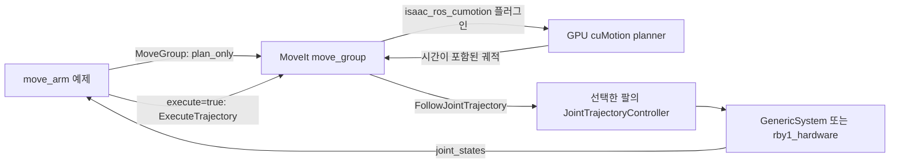

# RBY1 cuMotion 예제 — Humble / Isaac ROS release-3.2

`rby1_cumotion`은 **M v1.2 / A v1.2의 오른팔 또는 왼팔**을 선택하여,
현재 팔 끝 위치에서 `base` 기준으로 3cm 이동하는 경로를 계획합니다.
`execute:=true`를 명시하면 MoveIt의 `ExecuteTrajectory`를 거쳐 기존
`right_arm_controller` 또는 `left_arm_controller`로 실행합니다.

기본값은 **M v1.2 오른팔, 가상 하드웨어, 계획만 수행**입니다.
실기체 연결, GPU 계획 검증, CPU 비교 검증의 결과는 아래에서 구분합니다.

## 구성



- `prepare_model`: 설치된 `rby1_description` URDF/메시 및 기종별 MoveIt SRDF에서
  `robot.urdf`, `robot.xrdf`, `initial_positions.yaml`, `model.json`을 생성합니다.
- `demo.launch.py`: 기존 드라이버의 관절명, 관절 제한, IK 설정, 컨트롤러 설정을 재사용합니다.
  선택한 팔 컨트롤러, 나머지 15관절을 유지하는 `locked_joints_controller`,
  `joint_state_broadcaster`를 활성화합니다. 두 제어기의 관절은 겹치지 않습니다.
- `sim.launch.py`: 로컬 Docker M v1.2 시뮬레이터에 실제 ROS 드라이버를 연결하고,
  준비 자세의 피드백을 확인한 다음 SDK 하드웨어·MoveIt·RViz를 시작합니다.
- `planner.launch.py`: GPU 컨테이너만 별도로 실행할 때 사용할 cuMotion 서버입니다.
- `move_arm`: 모든 관절의 최신 상태와 고정 자세를 확인하고 Cartesian 목표를 요청합니다.
  계획 성공 후 관절 목록·관절 제한·시간·시작 상태를 검사합니다. 실행 중 상태가 끊기거나
  고정 관절이 바뀌면 액션 취소를 요청하고 오류로 종료합니다.

## 1. 호스트에서 패키지 빌드

기존 `ros2_driver_ws`가 빌드되어 있어야 합니다. 이 단계는 NVIDIA 패키지를 호스트에 설치하지 않습니다.

```bash
source /opt/ros/humble/setup.bash
source "$HOME/ros2_driver_ws/install/setup.bash"
cd "$HOME/isaac_ros_ws"
colcon build --base-paths src/rby1_isaac_ros/rby1_cumotion \
  --packages-select rby1_cumotion --symlink-install

# 기존 Isaac ROS 컨테이너의 다른 install 산출물과 섞이지 않도록 이 패키지만 source
source "$HOME/isaac_ros_ws/install/rby1_cumotion/share/rby1_cumotion/package.bash"
ros2 run rby1_cumotion prepare_model \
  --model m_1_2 --arm right \
  --output "$HOME/isaac_ros_ws/cumotion_models/host/m_1_2_right"
```

새 호스트 터미널마다 위의 세 `source` 명령을 실행합니다.
`--model a_1_2`, `--arm left`로 다른 기종/팔을 선택할 수 있습니다.
기종 또는 팔을 바꾸면 새로운 디렉터리에 모델을 생성하고 관련 노드를 다시 실행합니다.

## 2. cuMotion 없이 ROS 제어 경로 먼저 검증

GPU가 없어도 OMPL로 동일한 예제와 컨트롤러 경로를 확인할 수 있습니다.
이 결과는 cuMotion 검증 결과와 별도로 기록합니다.

터미널 1:

```bash
ros2 launch rby1_cumotion demo.launch.py \
  model_directory:="$HOME/isaac_ros_ws/cumotion_models/host/m_1_2_right" \
  pipeline:=ompl start_planner:=false use_fake_hardware:=true rviz:=false
```

터미널 2 — 계획만 수행:

```bash
ros2 run rby1_cumotion move_arm --ros-args \
  -p model_directory:="$HOME/isaac_ros_ws/cumotion_models/host/m_1_2_right" \
  -p pipeline:=ompl
```

터미널 2 — 가상 팔 실행:

```bash
ros2 run rby1_cumotion move_arm --ros-args \
  -p model_directory:="$HOME/isaac_ros_ws/cumotion_models/host/m_1_2_right" \
  -p pipeline:=ompl -p execute:=true
```

`PLAN_OK`, `EXECUTION_OK`가 출력되어야 합니다. 예제를 다시 실행하면 **현재 위치에서**
다시 이동하므로 반복 실행은 누적 이동입니다. 처음 자세로 재현하려면 가상 런치를 재시작합니다.
RViz를 사용하려면 `rviz:=true`로 실행합니다.

## 2.1. 실제 드라이버 → Docker 시뮬레이터 → RViz

이 경로는 **공식 RBY1 MuJoCo 시뮬레이터 `0.10.6-m_v1.2`**를 사용합니다.
`rby1_driver`와 `rby1_hardware`가 SDK/gRPC로 시뮬레이터를 제어하며,
RViz는 드라이버에서 읽은 실제 시뮬레이터 관절값을 표시합니다.
시뮬레이터는 컨테이너 안의 Xvfb 화면과 Mesa 소프트웨어 렌더링을 사용합니다.
호스트 NVIDIA 드라이버 복구 전에도 실행할 수 있습니다.

터미널 1 — 시뮬레이터 이미지 빌드 및 실행:

```bash
cd "$HOME/isaac_ros_ws/src/rby1_isaac_ros"
docker build -f docker/Dockerfile.sim -t rby1_cumotion_sim:m-v1.2 .
docker run --detach --rm --init --runtime=runc \
  --name rby1-cumotion-sim \
  --publish 127.0.0.1:50051:50051 \
  rby1_cumotion_sim:m-v1.2
docker logs --tail 10 rby1-cumotion-sim
```

`Server listening on 0.0.0.0:50051`을 확인합니다. `--init`은 Xvfb 시작 신호를
정상 처리하는 데 필요합니다. 호스트 공개 포트는 loopback으로 제한합니다.

터미널 1 — §1의 세 `source` 명령을 실행한 뒤:

```bash
export ROS_DOMAIN_ID=232 ROS_LOCALHOST_ONLY=1
export LIBGL_ALWAYS_SOFTWARE=1 __GLX_VENDOR_LIBRARY_NAME=mesa QT_X11_NO_MITSHM=1
ros2 launch rby1_cumotion sim.launch.py \
  model_directory:="$HOME/isaac_ros_ws/cumotion_models/host/m_1_2_right"
```

별도로 `rby1_driver`나 기존 MoveIt 런치를 중복 실행하지 않습니다.
이 런치는 시뮬레이터 전원/서보를 켜고, `/rby1/robot_joint` 액션으로 5초 준비 자세를
요청합니다. `SIM_READY`와 세 컨트롤러의 `activated` 로그 이후 이동 예제를 실행합니다.
시뮬레이터 연결에는 `use_fake_hardware=false`가 적용됩니다.
`prepare_sim`은 컨테이너 이미지·기종·loopback 포트·드라이버 주소가 맞지 않으면 거절합니다.

터미널 2 — 같은 세 `source` 명령과 ROS 환경 변수를 적용:

```bash
export ROS_DOMAIN_ID=232 ROS_LOCALHOST_ONLY=1
ros2 control list_controllers
ros2 run rby1_cumotion move_arm --ros-args \
  -p model_directory:="$HOME/isaac_ros_ws/cumotion_models/host/m_1_2_right" \
  -p pipeline:=ompl -p execute:=true

# 현재 위치에서 3cm 되돌아가기
ros2 run rby1_cumotion move_arm --ros-args \
  -p model_directory:="$HOME/isaac_ros_ws/cumotion_models/host/m_1_2_right" \
  -p pipeline:=ompl -p execute:=true -p 'offset_xyz:=[-0.03, 0.0, 0.0]'
```

RViz의 **Measured robot**은 `/joint_states` → TF의 피드백 모델입니다.
계획 애니메이션과 구분하여 확인할 수 있습니다. 준비 자세로 다시 시작하려면 런치를
Ctrl+C로 종료한 뒤 재실행합니다. 고정 관절 컨트롤러는 활성화 시점의 자세를 유지하므로,
실기체에 임의의 고정 자세 목표를 새로 보내지 않습니다.

### 자동 통합 테스트와 영상

아래 테스트는 장애물 삽입 시 MoveIt의 상태 유효성 검사에서 충돌이 검출되는지 확인하고
장애물을 제거합니다. 이어서 계획 전용 무동작, 느린 3cm 전진·복귀를 검사합니다.
**시뮬레이터 팔이 실제로 움직입니다.** 관절 피드백으로 계산한 FK 변위를 JSON에 기록합니다.
OMPL의 IK 해와 경로에 따라 실행 시간이 달라질 수 있습니다.

```bash
mkdir -p "$HOME/isaac_ros_ws/cumotion_artifacts"
python3 "$HOME/isaac_ros_ws/src/rby1_isaac_ros/rby1_cumotion/scripts/verify_simulation.py" \
  --ros-args \
  -p model_directory:="$HOME/isaac_ros_ws/cumotion_models/host/m_1_2_right" \
  -p pipeline:=ompl \
  -p report_file:="$HOME/isaac_ros_ws/cumotion_artifacts/simulation_report.json"
```

다른 터미널에서 시뮬레이터의 격리된 화면을 녹화할 수 있습니다.

```bash
docker exec -e DISPLAY=:99 -e XAUTHORITY=/tmp/rby1-sim.xauth rby1-cumotion-sim \
  ffmpeg -hide_banner -loglevel error -y -f x11grab -video_size 1280x900 \
  -framerate 15 -i :99 -t 120 -c:v libx264 -preset ultrafast \
  -pix_fmt yuv420p /tmp/rby1_motion.mp4
docker cp rby1-cumotion-sim:/tmp/rby1_motion.mp4 \
  "$HOME/isaac_ros_ws/cumotion_artifacts/simulator_motion.mp4"
```

종료: 먼저 ROS 런치 터미널에서 Ctrl+C, 이후 `docker stop rby1-cumotion-sim`.

## 3. cuMotion 개발 이미지

현재 `isaac_ros_common`의 `release-3.2`로 만든 기존 이미지를 확장합니다.
새 이미지 태그를 사용하며 기존 이미지를 덮어쓰지 않습니다.

```bash
cd "$HOME/isaac_ros_ws/src/rby1_isaac_ros"
docker build -f docker/Dockerfile.cumotion \
  --build-arg BASE_IMAGE=isaac_ros_dev-x86_64:latest \
  -t rby1_cumotion:humble-3.2 .
```

Jetson에서는 `BASE_IMAGE`에 해당 장치에서 만든 **release-3.2 / Humble** 이미지 이름을 지정합니다.
Ubuntu 24.04/Jazzy/Isaac ROS 4.x용 설정은 이 예제에 섞지 않습니다.

```bash
# GPU 드라이버가 정상인 호스트에서 실행
nvidia-smi
docker run --rm -it --name rby1_cumotion_dev \
  --gpus all --network host --ipc host \
  --user "$(id -u):$(id -g)" \
  -e ROS_DOMAIN_ID=42 -e ROS_LOCALHOST_ONLY=1 -e ROS_LOG_DIR=/tmp/rby1_cumotion_logs \
  -v "$HOME/isaac_ros_ws:/workspaces/isaac_ros-dev" \
  -v "$HOME/ros2_driver_ws/src/rby1_ros2:/workspaces/rby1_ros2:ro" \
  --entrypoint /bin/bash rby1_cumotion:humble-3.2
```

컨테이너 안에서 호스트의 `ros2_driver_ws/install`을 source하지 않습니다.
드라이버의 description/MoveIt 설정 패키지만 컨테이너 안에서 다시 빌드합니다.
가상 하드웨어에는 SDK와 실기체 드라이버 빌드가 필요하지 않습니다.

```bash
source /opt/ros/humble/setup.bash
cd /workspaces/isaac_ros-dev
colcon --log-base log_cumotion_container build \
  --base-paths src/rby1_isaac_ros/rby1_cumotion \
    /workspaces/rby1_ros2/rby1_description \
    /workspaces/rby1_ros2/rby1_moveit/rby1_moveit_m_1_2 \
    /workspaces/rby1_ros2/rby1_moveit/rby1_moveit_a_1_2 \
  --build-base build_cumotion_container --install-base install_cumotion_container
source install_cumotion_container/setup.bash

ros2 run rby1_cumotion prepare_model --model m_1_2 --arm right \
  --output /workspaces/isaac_ros-dev/cumotion_models/container/m_1_2_right
ros2 launch rby1_cumotion demo.launch.py \
  model_directory:=/workspaces/isaac_ros-dev/cumotion_models/container/m_1_2_right \
  use_fake_hardware:=true rviz:=false
```

다른 호스트 터미널에서 컨테이너에 접속:

```bash
docker exec -it rby1_cumotion_dev /bin/bash
source /opt/ros/humble/setup.bash
source /workspaces/isaac_ros-dev/install_cumotion_container/setup.bash
ros2 action list -t
ros2 run rby1_cumotion move_arm --ros-args \
  -p model_directory:=/workspaces/isaac_ros-dev/cumotion_models/container/m_1_2_right

# 계획 성공 후 가상 팔 실행
ros2 run rby1_cumotion move_arm --ros-args \
  -p model_directory:=/workspaces/isaac_ros-dev/cumotion_models/container/m_1_2_right \
  -p execute:=true
```

cuMotion의 첫 CUDA 초기화/워밍업이 끝난 뒤 요청합니다.
정상 액션은 `/cumotion/move_group`, `/move_action`, `/execute_trajectory`,
`/right_arm_controller/follow_joint_trajectory`입니다.
cuMotion 플러그인을 선택한 요청은 실패 시 OMPL로 자동 변경되지 않습니다.

## 4. GPU 컨테이너와 SDK 제어 호스트 분리

`rby1_driver`/`rby1_hardware`와 RViz는 기존 호스트 환경에서 사용합니다.
**MoveIt move_group과 cuMotion은 함께 GPU 컨테이너에서 실행**합니다.
cuMotion MoveIt 플러그인도 컨테이너 이미지에 설치되어 있기 때문입니다.
양쪽 ROS_DOMAIN_ID를 동일하게 설정하고
동일한 기종·팔·고정 자세로 모델을 각각 생성해야 합니다. 메시의 절대 경로 때문에
호스트용 `robot.urdf`를 컨테이너에 그대로 넘기면 안 됩니다.

### Docker 시뮬레이터로 먼저 연결

§2.1의 호스트 런치를 종료하고, §3에서 만든 GPU 컨테이너와 같은 ROS 도메인으로 재시작합니다.

```bash
# 호스트: 준비 자세 이동, SDK 제어기, TF, RViz
export ROS_DOMAIN_ID=42 ROS_LOCALHOST_ONLY=1
ros2 launch rby1_cumotion sim.launch.py \
  model_directory:="$HOME/isaac_ros_ws/cumotion_models/host/m_1_2_right" \
  start_moveit:=false
```

```bash
# GPU 컨테이너: §3의 빌드·모델 생성 및 source 이후
ros2 launch rby1_cumotion demo.launch.py \
  model_directory:=/workspaces/isaac_ros-dev/cumotion_models/container/m_1_2_right \
  start_control:=false start_state_publisher:=false rviz:=false
```

호스트에서 실행:

```bash
ros2 run rby1_cumotion move_arm --ros-args \
  -p model_directory:="$HOME/isaac_ros_ws/cumotion_models/host/m_1_2_right" \
  -p pipeline:=isaac_ros_cumotion -p execute:=true
```

CPU로 분리 구성을 점검하려면 컨테이너 런치에
`pipeline:=ompl start_planner:=false`를 추가하고 예제에도 `pipeline:=ompl`을 지정합니다.
호스트에 별도 cuMotion MoveIt 플러그인을 설치한 환경에서는
`planner.launch.py`만 GPU 컨테이너에서 실행하는 구성도 가능합니다.

### 실기체 적용 시 자세 일치

1. 기존 드라이버 설정의 `robot_ip`와 실제 기종을 맞추고 `rby1_driver`를 실행합니다.
2. `/rby1/joint_states`의 실제 몸통·머리·반대팔 값을 YAML `initial_positions`에 기록합니다.
   기본 가상 자세를 실기체의 실제 자세로 가정하지 않습니다.
3. 양쪽에서 `prepare_model --posture <같은_자세.yaml>`을 실행합니다.
   몸통·머리·반대팔은 해당 자세로 유지합니다. 모바일 베이스도 정지 상태를 유지합니다.
4. 컨테이너의 MoveIt/cuMotion은 위 `start_control:=false start_state_publisher:=false` 구성으로 실행합니다.

5. 호스트에서 **실기체 연결 및 전원/서보 활성화를 의도할 때** 실행합니다.
   `rby1_hardware`의 기존 `on_activate()`가 드라이버의 전원·서보 서비스를 호출합니다.

```bash
export ROS_DOMAIN_ID=42 ROS_LOCALHOST_ONLY=1
ros2 launch rby1_cumotion demo.launch.py \
  model_directory:="$HOME/isaac_ros_ws/cumotion_models/host/m_1_2_right" \
  pipeline:=ompl start_moveit:=false start_planner:=false use_fake_hardware:=false \
  robot_ip:=192.168.1.40:50051 driver_namespace:=rby1
```

이미 컨트롤러 관리자가 실행 중이면 `start_control:=false`를 추가하고
선택한 팔의 컨트롤러가 활성화되어 있는지 확인합니다.
고정 관절을 유지할 제어기도 활성화되어 있어야 합니다. `rby1_hardware`의 `read()`는
제어기가 명령하지 않는 관절의 목표를 현재 측정값으로 매번 갱신하기 때문에,
고정 관절 제어기가 없으면 시뮬레이터에서 자세가 서서히 변할 수 있습니다.
기존 `demo.launch.py`와 함께 실행하여 `move_group`/`robot_state_publisher`를 중복 생성하지 않습니다.

6. 호스트에서 `move_arm`의 기본 계획을 확인하고 `-p execute:=true`로 실행합니다.
   예제는 `Locked joint ...` 또는 `Stale/nonfinite joint state ...` 오류가 있으면 실행하지 않습니다.

## 주요 파라미터

| 위치 | 파라미터 | 기본값 / 의미 |
|---|---|---|
| 모델 생성 | `--model`, `--arm` | `m_1_2`, `right`; 지원 기종 `m_1_2`, `a_1_2` |
| 모델 생성 | `--posture` | `initial_positions` YAML; 단위 rad, 고정 자세 변경 시 재생성 |
| 모델 생성 | `--cell-size` | `0.08` m; 작은 값은 구 개수와 계산량을 증가시킴 |
| 런치/예제 | `pipeline` | `isaac_ros_cumotion`; CPU 비교는 `ompl` |
| 시뮬레이터 런치 | `pipeline`, `start_planner` | `ompl`, `false` |
| 런치 | `start_moveit`, `start_state_publisher` | 각각 `true`; 호스트/컨테이너 분리 시 중복 노드 방지 |
| 예제 | `execute` | `false` |
| 예제 | `offset_xyz` | `[0.03, 0.0, 0.0]` m, base 좌표계; 크기 최대 0.1 m |
| 예제 | `velocity_scaling`, `acceleration_scaling` | 각각 `0.1` |
| 예제 | `locked_joint_tolerance` | `0.01` rad |
| 예제 | `state_max_age` | `2.0` 초; 수신 시각과 메시지 timestamp 모두 검사 |
| 예제 | `server_timeout`, `planning_time` | `120.0`, `30.0` 초 |

## 충돌 모델과 현재 범위

- 각 URDF 충돌 메시의 경계 상자를 작은 셀로 나눈 뒤, 각 셀 전체를 포함하는 구를 생성합니다.
  메시 표면/내부를 보수적으로 포함하지만 빈 공간도 포함하므로 통과 가능한 경로를 거절할 수 있습니다.
  기본 구 개수는 M v1.2 741개, A v1.2 647개이며 CUDA 실행을 고려해 900개를 넘는 생성은 거절합니다.
- XRDF에는 팔 외에도 몸통·머리·반대팔·베이스·그리퍼 형상을 포함합니다.
  SRDF의 충돌 제외 쌍을 재사용하고, 관절 고정 후 서로 상대 위치가 변하지 않는 링크 쌍도 제외합니다.
- 그리퍼 손가락은 URDF 제한 범위 전체를 덮는 고정 충돌 상자로 표현합니다.
  그리퍼 위치를 가짜 관절 상태로 발행하지 않습니다. 이 예제는 그리퍼를 제어하지 않습니다.
- **M v1.3은 미지원**입니다. 자동 생성한 경계 상자가 서로 끼워진 손목 링크 4/6에서 겹침을 확인했습니다.
  해당 기종은 실제 형상에 맞춘 충돌 구가 필요하며, 충돌 검사를 끄는 방식으로 우회하지 않았습니다.
- 한 번에 한 팔을 계획합니다. 양팔 동시 계획, 몸통 동시 이동, 이동 베이스 계획,
  부착 물체, nvblox/깊이 센서 장애물 통합은 포함하지 않습니다.
- 외부 환경은 MoveIt PlanningScene에 등록된 장애물만 반영됩니다. 예제만 실행하면 주변 물체가
  자동으로 인식되지 않습니다. 모델의 충돌 검사를 통과한 사실만으로 실기체 충돌 회피를 보장할 수 없습니다.
- 직접 RViz의 Plan & Execute를 사용하는 경우 `move_arm`의 고정 자세/상태 검사는 거치지 않습니다.
  실기체 예제 실행은 `move_arm`을 기준으로 합니다.

## 검증 및 비교

```bash
source /opt/ros/humble/setup.bash
source "$HOME/ros2_driver_ws/install/setup.bash"
cd "$HOME/isaac_ros_ws/src/rby1_isaac_ros/rby1_cumotion"
PYTEST_DISABLE_PLUGIN_AUTOLOAD=1 python3 -m pytest -q
```

`PYTEST_DISABLE_PLUGIN_AUTOLOAD=1`은 호스트의 무관한 pytest 플러그인 버전 충돌을 피합니다.
설치된 RBY1 모델로 양쪽 팔의 관절 제한, 충돌 링크 누락, 기본 자세에서의 구 겹침을 검사합니다.
잘못된 관절명, NaN, 비단조 시간, 제한 초과, 시작 자세 변화도 검사합니다.

2026-09-15 작업 환경에서 확인한 결과:

- 공식 Docker M v1.2 시뮬레이터 + 실제 `rby1_driver`/`rby1_hardware` + MoveIt OMPL 실행 성공.
  선택한 팔과 고정 15관절의 제어기를 함께 활성화했습니다.
- 3cm 전진 및 복귀 성공. 시뮬레이터 드라이버 관절값으로 계산한 FK 목표 오차는
  전진 **1.29mm**, 복귀 **1.44mm**, 왕복 후 처음 위치와의 차이는 **0.66mm**입니다.
  속도/가속도 배율 0.02에서 각 궤적은 약 39초였고, 계획은 각각 약 0.024/0.026초였습니다.
  이는 시뮬레이터에서의 제어 검증이며 실기체의 위치 정확도를 뜻하지 않습니다.
- 실행 중 고정 관절 변화 최대 약 0.000123rad, 드라이버와 ros2_control 피드백 차이는
  최대 약 0.000080rad. 계획 전용 요청 전후 관절 변화는 약 0.000036rad 이하였습니다.
- 팔과 겹치는 20cm 상자를 PlanningScene에 넣자 충돌로 상태 유효성 검사가 실패했고,
  제거 후 다시 유효해졌습니다. 실제 MoveIt 메시 충돌 형상의 로드를 확인했습니다.
  생성 URDF의 파일 경로는 ROS에 전달할 때 `file://` URI로 변환합니다.
- RViz 영상, MuJoCo 영상, `simulation_report.json`, `simulation_test.log`는
  워크스페이스의 `cumotion_artifacts/`에 저장했습니다.
- MoveIt을 개발 컨테이너로 옮긴 §4의 분리 구성도 **OMPL로** 동일한 자동 통합 테스트를 통과했습니다.
  이 실행의 전진/복귀 목표 오차는 1.77/1.49mm, 왕복 위치 차이는 3.02mm였습니다.
  두 번의 상대 목표 오차가 누적될 수 있으며, 관절 경로도 첫 실행과 달랐습니다.
  결과는 `simulation_split_report.json`, 영상은 `rviz_split_motion.mp4`입니다.
- `rby1_cumotion:humble-3.2` 이미지 빌드 성공.
  설치 버전: `isaac_ros_cumotion 3.2.7`, `isaac_ros_cumotion_moveit 3.2.5`, `curobo_core 3.2.5`.
- 컨테이너 안에서 description, 기종별 MoveIt 설정 2개, `rby1_cumotion` 재빌드와 모델 생성 성공.
- 자동 테스트 45개 통과. NVIDIA 파서의 import도 CUDA 확장을 요구하므로
  실제 cuRobo 모델 로드 검증은 GPU 환경에서 완료해야 합니다.
- 호스트 GPU: `Failed to initialize NVML: Driver/library version mismatch`
  (`NVML library version: 580.178`). **GPU 경로 계획 및 실기체 동작은 미검증**입니다.

GPU 복구 후 같은 초기 자세·목표·속도 배율에서 OMPL/cuMotion 각각의 `PLAN_OK` 로그,
성공률, planning/wall time, GPU 메모리를 기록합니다. 첫 CUDA 워밍업과 후속 계획 시간을
분리해서 비교합니다. GPU 우위나 실기체 성공을 CPU 검증 결과로 추정하지 않습니다.

## NVIDIA 드라이버와 라이브러리가 다른 원인

이 PC에서는 **부팅 후 Ubuntu 자동 업데이트가 NVIDIA 패키지를 교체한 것**이 원인이었습니다.
2026-09-15 확인 값:

| 항목 | 값 |
|---|---|
| 부팅 | 08:53:37 |
| `unattended-upgrade` 실행 | 09:26:31–09:27:15 |
| 메모리에 로드된 NVIDIA 커널 모듈 | 580.173.02 |
| 설치된 NVML/사용자 라이브러리 | 580.178.04 |
| 디스크의 NVIDIA 커널 모듈 / DKMS | 580.178.04, 현재 커널 6.8.0-138-generic에 설치 완료 |

이미 로드된 모듈은 패키지 업데이트만으로 바뀌지 않아 `nvidia-smi`가
`Driver/library version mismatch`를 출력했습니다. 호스트에서 발생한 문제이므로
Docker 이미지를 다시 빌드해도 해결되지 않습니다. 새 모듈은 이미 설치되어 있어,
**작업 저장과 테스트 종료 후 재부팅하고 버전을 확인하는 순서**가 적절합니다.

```bash
# 현재 값 확인
cat /sys/module/nvidia/version
modinfo -F version nvidia
nvidia-smi

# 작업을 저장하고 ROS/시뮬레이터를 종료한 후 사용자가 실행
sudo reboot

# 재부팅 이후
cat /sys/module/nvidia/version
nvidia-smi
docker run --rm --gpus all --entrypoint nvidia-smi rby1_cumotion:humble-3.2
```

두 모듈 버전과 NVML이 일치하는지 먼저 확인하고, 이후 §4의 cuMotion CUDA 워밍업과
실제 계획을 별도로 검증합니다. 이번 작업에서는 시스템을 재부팅하거나 드라이버를 재설치하지 않았습니다.
[Ubuntu 공식 NVIDIA 드라이버 문제 해결 문서](https://ubuntu.com/server/docs/how-to/graphics/install-nvidia-drivers/)도
업데이트 후 모듈/라이브러리 불일치에 재부팅을 안내합니다.

## 참고 근거

- [Notion: isaac_ros2 프로젝트](https://app.notion.com/p/3d50f921eed78138a0c9d01fecb40551)
- [Notion: Development Harness & Environment](https://app.notion.com/p/3d50f921eed781908dccebe3b0cea35b)
- [Notion: References & Architecture](https://app.notion.com/p/3d50f921eed78196845fc2e0a122d647)
- [NVIDIA cuMotion MoveIt, release-3.2](https://nvidia-isaac-ros.github.io/v/release-3.2/repositories_and_packages/isaac_ros_cumotion/isaac_ros_cumotion_moveit/index.html)
- [NVIDIA cuMotion planner source, release-3.2](https://github.com/NVIDIA-ISAAC-ROS/isaac_ros_cumotion/blob/release-3.2/isaac_ros_cumotion/isaac_ros_cumotion/cumotion_planner.py)
- [Rainbow Robotics 공식 RBY1 시뮬레이터 이미지](https://hub.docker.com/r/rainbowroboticsofficial/rby1-sim)
- 로컬 `ros2_driver_ws/src/rby1_ros2/Doc/moveit_controller_guide.md`, 기종별 `config/`,
  `rby1_hardware/src/rby1_system_hardware.cpp`와 대조했습니다. 문서의 컨트롤러 구성 설명과
  실제 YAML은 일부 달라 실제 코드의 인터페이스를 기준으로 필요한 팔 컨트롤러만 활성화합니다.
