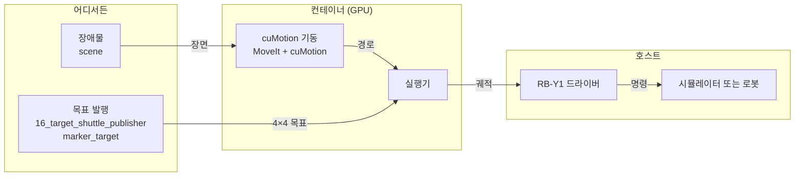
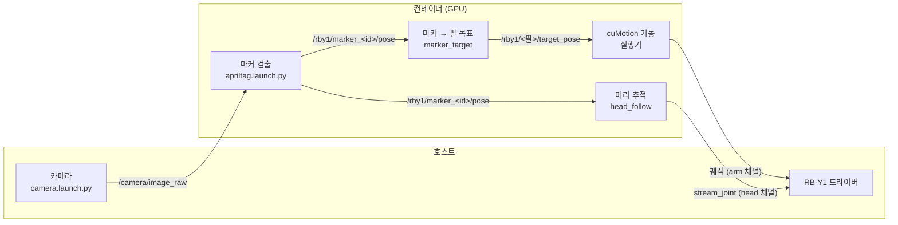

# RB-Y1 cuMotion 사용 가이드

NVIDIA cuMotion으로 RB-Y1의 팔을 움직입니다. 목표 자세(4×4 행렬)를 토픽으로 보내면 GPU가 장애물을 피하는
경로를 계획하고, RB-Y1 드라이버를 통해 로봇이 그 경로대로 움직입니다. 움직이는 도중에 장애물이 경로에 나타나면 멈추지 않고
돌아서 가고, 움직이는 장애물이면 멈춰서 지나가길 기다린 뒤 이어 갑니다. 시뮬레이터와 실제 로봇은 같은 방법으로 씁니다.


```mermaid
flowchart LR
    subgraph host["호스트"]
        robot["시뮬레이터 또는 로봇"]
        driver["RB-Y1 드라이버"]
    end
    subgraph container["컨테이너 (GPU)"]
        planner["cuMotion 기동<br/>MoveIt + cuMotion"]
        executor["실행기"]
    end
    subgraph anywhere["어디서든"]
        target["목표 발행<br/>16_target_shuttle_publisher<br/>marker_target"]
        scene["장애물<br/>scene"]
    end
    driver -->|명령| robot
    planner -->|경로| executor
    executor -->|궤적| driver
    target -->|4×4 목표| executor
    scene -->|장면| planner
```

**위에서 아래로 순서대로 따라 하면 됩니다.** 문제가 생기면 그 터미널에 나오는 메시지가 원인과 할 일을 알려 줍니다.
더 자세한 원인은 [developer_manual.md의 트러블슈팅](developer_manual.md#12-트러블슈팅)에 있습니다.

> ⚠️ 시뮬레이터에서 확인한 절차입니다. 실제 로봇에서는 아직 돌려 보지 않았습니다(§4.3 참고).

### 한눈에 보기

```bash
# 터미널1 : 호스트
ros2 launch rby1_driver rby1_ros2_driver.launch.py                  # 드라이버
# 터미널2 : 자세초기화
ros2 run rby1_examples 06_zero_pose                                 # 전원·서보 + 영점
# 터미널3 : 컨테이너 (isaac-ros)
ros2 launch rby1_cumotion demo.launch.py                            # cuMotion 기동: 준비 → 계획 → 목표를 받으면 움직임
# 어디서든
ros2 run rby1_examples 16_target_shuttle_publisher --ros-args -p cycles:=1   # 예제: 목표 두 개 발행 (§4)
```

---

## 1. 준비물

| 항목 | 값 |
|---|---|
| OS / ROS | Ubuntu 22.04(Humble),Ubuntu 24.04(Jazzy)|
| GPU | NVIDIA, 메모리 12 GB 이상 권장 |
| 환경 | [env_setup_ubuntu_22_04.md](env_setup_ubuntu_22_04.md), 혹은 [env_setup_ubuntu_24_04.md](env_setup_ubuntu_24_04.md)를 끝낸 상태 (GPU 드라이버, Docker, `isaac-ros` 명령) |
| 드라이버 | `~/ros2_driver_ws`가 빌드된 상태 (드라이버 저장소 README) |

```
~/isaac_ros_ws/src/isaac_ros_common      NVIDIA 공식 (release-3.2)
~/isaac_ros_ws/src/rby1_isaac_ros        이 저장소
~/ros2_driver_ws/src/rby1_ros2           RB-Y1 ROS 2 드라이버
~/sdk/rby1-sdk                           RB-Y1 SDK
```

> 호스트와 컨테이너의 `ROS_DOMAIN_ID`가 같아야 합니다(둘 다 설정하지 않았다면 이미 같습니다).

---

## 2. 설치 (처음 한 번)

### 2.1. 이미지 만들기 — 호스트

```bash
cd ~/isaac_ros_ws/src/rby1_isaac_ros/docker
./make_bundles.sh                    # 로봇 모델 파일 준비 (이미지에 들어갑니다)

cp ~/isaac_ros_ws/src/rby1_isaac_ros/docker/isaac_ros_common-config ~/.isaac_ros_common-config
cd ~/isaac_ros_ws/src/isaac_ros_common/scripts
./run_dev.sh -d ~/isaac_ros_ws       # 이미지를 만들고 컨테이너에 들어갑니다
```

첫 빌드는 수십 분 걸립니다. 끝나면 프롬프트가 `admin@…:/workspaces/isaac_ros-dev$`로 바뀝니다.

### 2.2. cuMotion 패키지 빌드 — 컨테이너

```bash
cd /workspaces/isaac_ros-dev
colcon build --base-paths src/rby1_isaac_ros/rby1_cumotion \
    --packages-select rby1_cumotion --symlink-install
```

이후 컨테이너에 들어올 때마다 자동으로 source됩니다.

---

## 3. 실행 (매번)

터미널 네 개를 씁니다.

| 터미널 | 위치 | 하는 일 |
|---|---|---|
| 1 | 호스트 | 시뮬레이터 (실제 로봇이면 필요 없음) |
| 2 | 호스트 | 드라이버 |
| 3 | 컨테이너 | cuMotion 기동 — 이 터미널의 프로그램이 로봇을 움직입니다 |
| 4 | 호스트 | 목표 보내기, 장애물 넣기 |

호스트 터미널에서는 먼저 `source ~/ros2_driver_ws/install/setup.bash`를 합니다.

### 3.1. 시뮬레이터 — 터미널 1

```bash
xhost +local:root
docker run --rm -it -e DISPLAY=$DISPLAY -v /tmp/.X11-unix:/tmp/.X11-unix \
    -p 50051:50051 rainbowroboticsofficial/rby1-sim:0.10.6-m_v1.2
```

로봇 기종에 맞는 태그를 고르십시오. 시뮬레이터 창이 떠야 합니다.

### 3.2. 드라이버 — 터미널 2

```bash
ros2 launch rby1_driver rby1_ros2_driver.launch.py
```

접속 대상은 `rby1_driver/config/driver_parameters.yaml`의 `robot_ip`입니다(기본 `127.0.0.1:50051` = 시뮬레이터).
실제 로봇이면 로봇 주소로 바꿉니다. 다른 설정은 바꾸지 않습니다.

확인 (터미널 4):

```bash
ros2 topic echo /rby1/robot_state --once --field robot_version     # 예: 1.2
```

### 3.3. 시작 자세 — 터미널 3

```bash
ros2 run rby1_examples 06_zero_pose        # 전원·서보를 켜고 모든 관절을 0으로
```

§4의 예제 좌표가 맞도록 영점에서 시작합니다. 3.5가 펴져 있는 **양팔과 몸통**을 한 번에 **준비 자세**(팔: 팔꿈치 90° 굽혀
앞으로 내민 자세, 몸통: 무릎을 0.2 rad 굽히고 가슴은 곧게)로 옮기고, 예제 좌표는 그 자세 기준입니다. 다른 자세에서 시작해도
동작하지만 좌표는 자세에 맞게 바꿔야 합니다. 준비 자세의 관절 값은 `cumotion.yaml`의 `robot.ready_pose`에서 바꿉니다.

> 왜 준비 자세인가: 팔을 곧게 편 영점에서는 같은 손 위치를 만드는 팔 모양이 여러 가지라, 손을 옮겼다 되돌려도
> **팔이 비틀린 모양으로** 돌아올 수 있습니다(손 위치는 맞음). 그래서 기동할 때 팔꿈치가 펴진 팔을 먼저 굽힙니다.

> ⚠️ cuMotion은 기동할 때의 자세를 기억합니다. 기동한 뒤에 계획하는 팔 이외의 관절(반대팔·몸통)을
> 움직이면 3.5를 다시 켜야 합니다. 머리는 예외입니다(움직여도 됨).

### 3.4. 컨테이너 켜기·들어가기 — 터미널 4

```bash
isaac-ros
```

컨테이너가 꺼져 있으면 켜고 들어가고, 켜져 있으면 그 컨테이너에 추가로 들어갑니다.
프롬프트가 `admin@…:/workspaces/isaac_ros-dev$`이면 됩니다. `root@…`이면 드라이버 토픽을 받지 못하니 나가서 `isaac-ros`로
다시 들어가십시오(`isaac-ros`가 root로 들어가면 [env_setup 8.2](env_setup_ubuntu_22_04.md)대로 고칩니다).

`isaac-ros`를 등록하지 않았다면([env_setup 8.2](env_setup_ubuntu_22_04.md)) 참고

> ⚠️ 컨테이너는 **처음 켠 터미널을 닫으면 삭제**됩니다. 작업이 끝날 때까지 그 터미널을 닫지 마십시오.

### 3.5. cuMotion 기동 — 터미널 4 (컨테이너)

```bash
ros2 launch rby1_cumotion demo.launch.py          # RViz 포함
ros2 launch rby1_cumotion cumotion.launch.py      # 창 없이
```

이 한 줄이 순서대로 합니다: 로봇 확인(기종·버전, 비상정지, 고장) → 전원·서보 → 펴진 양팔과 몸통을 준비 자세로(**로봇이
움직입니다 — 양쪽 팔과 몸통 모두**) → 자세 기억 → cuMotion과 실행기 기동. 기본으로 **오른팔**을 계획합니다. 마지막에
`READY`가 나오면 됩니다(1분 안팎):

```
[prepare-1] power and servos on
[prepare-1] straight: right_arm, left_arm, torso -- moving them to the ready pose together
[prepare-1] right_arm, left_arm, torso at the ready pose
[prepare-1] PREPARED model=m_1_2 group=right_arm posture=measured hardware=driver ...
[cumotion_planner] cuMotion is ready for planning queries!
[target_executor] waiting for 4x4 targets on /rby1/right_arm/target_pose (group=right_arm, tool=ee_right, frame=base)
[target_executor] READY
```

**이 런치가 떠 있는 동안 목표를 받으면 로봇이 움직입니다.** 준비 단계가 실패하면 `PREPARE_FAILED: <이유>`를 내고
아무것도 켜지 않은 채 끝납니다.

> 기동 로그의 `No 3D sensor plugin(s) defined for octomap updates` ERROR는 정상입니다.

설정(속도, 그룹 등)은 [6. 설정](#6-설정)에 있습니다.

(선택) 로봇을 움직이지 않고 계획만 확인하려면, 컨테이너 터미널을 하나 더 열어(`isaac-ros`):

```bash
ros2 run rby1_cumotion check_plan
```

---

## 4. 예제 — 터미널 3 (호스트)

실행기에 목표를 보내는 예제는 `rby1_examples`의 `16_target_shuttle_publisher`이고, 장애물은 `rby1_moveit_objects`의 `scene` 명령으로 넣고
뺍니다. 아래 단계를 차례로 따라 하면 cuMotion이 하는 일을 하나씩 볼 수 있습니다. 좌표는 오른팔 준비 자세 기준입니다.

| 목표를 보내는 것 | 하는 일 | 끝 |
|---|---|---|
| `16_target_shuttle_publisher` | 두 자세 `point_a`·`point_b`를 `period`초(기본 5초)마다 번갈아 발행. 발행만 하고, 실행기의 답(`EXECUTING …`, `DONE`, `FAILED: …`)은 받은 대로 출력. `cycles:=1`이면 `point_a` 한 번, `point_b` 한 번 | `cycles`번 왕복한 뒤 (`cycles:=0`이면 Ctrl+C) |
| `rby1_apriltag`의 `marker_target.launch.py` | 카메라가 본 마커를 팔 목표로 계속 보냄 — §4.7 | Ctrl+C |

예제의 파라미터는 파일 맨 위 설명에 있습니다(`rby1_examples/rby1_examples/16_target_shuttle_publisher.py`). RViz(`demo.launch.py`)에서
장애물이 나타나고 움직이는 것이 보입니다.

예제는 목표만 발행합니다. 팔이 도착하기를 기다리지 않고 `period`초마다 다음 목표를 보내므로, `period`는 한 번 움직이는
시간보다 길어야 합니다. 움직이는 중에 다음 목표가 오면 cuMotion 실행기는 바로 그 목표로 바꿉니다(⑥의 `REPLACED`).
실행기의 답은 예제가 받은 대로 출력하고, 다른 터미널에서 직접 볼 수도 있습니다:

```bash
ros2 topic echo /rby1/right_arm/target_status std_msgs/msg/String
```

> `15_cartesian_target_move`는 같은 목표 토픽을 받는 가장 단순한 실행기입니다. 계획 없이 드라이버의 Cartesian 명령으로 손을
> 곧장 보내고 장애물을 보지 않습니다. **cuMotion 기동과 같이 켜지 않습니다** — 둘 다 같은 팔을 움직이게 되므로, 목표 토픽을
> 듣는 것이 이미 있으면 예제가 시작하지 않습니다(드라이버 저장소 README).

**① 목표로 이동** — 손을 앞·위로 5 cm 보냈다가 준비 자세 손 위치로 되돌립니다.

```bash
ros2 run rby1_examples 16_target_shuttle_publisher --ros-args -p cycles:=1 \
    -p "point_a:=[0.463,-0.367,1.166,-1.571,-1.071,1.571]" -p "point_b:=[0.413,-0.367,1.116,-1.571,-1.071,1.571]"
```

목표마다 `EXECUTING …`, `DONE`이 나옵니다. 지점은 항상 값 6개(x, y, z, roll, pitch, yaw)이고, `-1.571, -1.071, 1.571`은
준비 자세의 오른손 방향입니다.

**② 막힌 목표** — 손을 15 cm 앞으로 보내는데, 손목이 갈 자리에 상자를 둡니다. 계획이 실패하고 로봇은 움직이지 않습니다.

```bash
ros2 run rby1_moveit_objects scene add box wall --xyz 0.437 -0.367 1.116 --size 0.04 0.04 0.04
ros2 run rby1_examples 16_target_shuttle_publisher --ros-args -p cycles:=1 \
    -p "point_a:=[0.563,-0.367,1.116,-1.571,-1.071,1.571]" \
    -p "point_b:=[0.413,-0.367,1.116,-1.571,-1.071,1.571]"                    # point_a의 답: FAILED: planning failed …
ros2 run rby1_moveit_objects scene remove wall
ros2 run rby1_examples 16_target_shuttle_publisher --ros-args -p cycles:=1 \
    -p "point_a:=[0.563,-0.367,1.116,-1.571,-1.071,1.571]" \
    -p "point_b:=[0.413,-0.367,1.116,-1.571,-1.071,1.571]"                    # point_a의 답: DONE
```

**③ 왕복하며 장애물 돌아가기** — 준비 자세 손 위치(`point_a`)와 그 30 cm 위(`point_b`)를 오갑니다. 두 지점 한가운데에 상자를
두면 구간마다 돌아서 갑니다.

```bash
ros2 run rby1_examples 16_target_shuttle_publisher
ros2 run rby1_moveit_objects scene add box shuttle_box --xyz 0.413 -0.367 1.266 --size 0.06 0.06 0.06
ros2 run rby1_examples 16_target_shuttle_publisher --ros-args -p cycles:=2
ros2 run rby1_moveit_objects scene remove shuttle_box
```

목표마다 `EXECUTING …`, `DONE`이 나옵니다. 예제는 `DONE`을 기다리지 않고, 손이 지점에 얼마나 가깝게 갔는지도 재지 않습니다.

**④ 움직이는 도중에 생긴 장애물** — 팔이 천천히 움직여야 도중에 넣을 시간이 있으므로 **이동 시간을 먼저 고정**합니다. 이동이
10초이므로 예제의 `period`도 그보다 길게(13초) 줍니다. 예제를 켜고, `-> point_b` 줄이 나오면 **바로(2초 안에)** 다른 터미널에서
상자를 넣습니다. 첫 목표(`point_a`)는 제자리라 10초 그대로 지나가고, `-> point_b` 줄은 시작하고 13초 뒤에 나옵니다.

```bash
ros2 param set /rby1_target_executor duration 10.0
ros2 run rby1_examples 16_target_shuttle_publisher --ros-args -p cycles:=1 -p period:=13.0 \
    -p "point_b:=[0.413,-0.367,1.466,-1.571,-1.071,1.571]"
# "-> point_b"가 나오면 바로, 다른 터미널에서:
ros2 run rby1_moveit_objects scene add box shuttle_box --xyz 0.29 -0.37 1.32 --size 0.06 0.06 0.06
# 끝난 뒤:
ros2 run rby1_moveit_objects scene remove shuttle_box
```

```
round 1/1: -> point_b [0.413, -0.367, 1.466, -1.571, -1.071, 1.571]
      PLANNING
      EXECUTING planner_time=0.257s duration=10.00s (duration) steps=201 peak_velocity=3%
      AVOIDING replanned in 0.17s (cuRobo 0.15s), takes over 0.10s ahead; joint speed there 0.205 rad/s, …
      DONE
```

상자가 늦게(구간이 시작되고 4초 뒤) 들어가면 팔이 이미 그 옆에 있어 `FAILED: obstacle too close to plan around in time …`으로
멈춥니다.

**⑤ 가로질러 오는 장애물** — 상자를 옆에 미리 두고, `-> point_b`가 나오면 **바로(2초 안에)** 0.1 m/s로 밀어 팔 앞을 지나가게 합니다.

```bash
ros2 run rby1_moveit_objects scene add box probe --xyz 0.29 -0.67 1.32 --size 0.06 0.06 0.06
ros2 run rby1_examples 16_target_shuttle_publisher --ros-args -p cycles:=1 -p period:=13.0 \
    -p "point_b:=[0.413,-0.367,1.466,-1.571,-1.071,1.571]"
# "-> point_b"가 나오면 바로, 다른 터미널에서:
ros2 run rby1_moveit_objects scene move probe --velocity 0 0.1 0 --time 7
# 끝난 뒤:
ros2 run rby1_moveit_objects scene remove probe
```

```
round 1/1: -> point_b [0.413, -0.367, 1.466, -1.571, -1.071, 1.571]
      PLANNING
      EXECUTING planner_time=0.247s duration=10.00s (duration) steps=201 peak_velocity=3%
      WAITING for a moving obstacle (probe) to pass; braking over 0.60s
      RESUMING on the path after waiting 1.2s
      DONE
```

**⑥ 움직이는 도중에 온 새 목표** — 30 cm 위로 가는 목표를 보내고, 3초쯤 뒤 앞으로 15 cm인 목표를 보냅니다. 목표는 토픽에
4×4 행렬(§4.5)을 바로 실어 보냅니다. 실행기의 답은 다른 터미널에서
`ros2 topic echo /rby1/right_arm/target_status std_msgs/msg/String`으로 봅니다.

```bash
ros2 param set /rby1_target_executor duration 6.0
ros2 topic pub --once /rby1/right_arm/target_pose std_msgs/msg/Float64MultiArray \
    "{data: [0.0012,-0.0001,-1.0,0.413, 0.4792,0.8777,0.0004,-0.367, 0.8777,-0.4792,0.0011,1.416, 0.0,0.0,0.0,1.0]}"
# 3초쯤 뒤:
ros2 topic pub --once /rby1/right_arm/target_pose std_msgs/msg/Float64MultiArray \
    "{data: [0.0012,-0.0001,-1.0,0.563, 0.4792,0.8777,0.0004,-0.367, 0.8777,-0.4792,0.0011,1.116, 0.0,0.0,0.0,1.0]}"
```

```
REPLACED by a newer target
EXECUTING toward the new target (replanned in 0.16s, takes over 0.09s ahead)
DONE
```

끝나면 이동 시간을 되돌리고 손을 준비 자세로 보냅니다.

```bash
ros2 param set /rby1_target_executor duration 0.0
ros2 topic pub --once /rby1/right_arm/target_pose std_msgs/msg/Float64MultiArray \
    "{data: [0.0012,-0.0001,-1.0,0.413, 0.4792,0.8777,0.0004,-0.367, 0.8777,-0.4792,0.0011,1.116, 0.0,0.0,0.0,1.0]}"
```

실행기 상태(`/rby1/right_arm/target_status`, 예제가 그대로 출력)의 뜻:

- `AVOIDING`: 서 있는 장애물 — 새 경로로 바꿔 타고 멈추지 않습니다.
- `WAITING`: 움직이는 장애물 — 경로 위에서 멈춥니다. 멈출 자리도 장애물이 지나갈 길이면 왔던 경로를 따라 조금 물러납니다.
- `RESUMING on the path`: 길이 비면 원래 경로대로, `RESUMING around the obstacle`: 장애물이 멈췄으면 돌아서 갑니다.
- 멈춘 채 2초(`avoid.wait_before_replan`) 넘게 막혀 있으면 그 자리에서 새 길을 계획합니다(`RESUMING along a new path (1 of at most 3)`).
  한 목표에 3번(`avoid.max_replans`)까지입니다.
- `REPLACED`: 움직이는 중에 새 목표가 오면 이전 목표를 버리고, 팔이 가던 위치·속도에서 새 목표로 다시 계획해 멈추지 않고 갑니다.
  빠르게 움직이는 중이라 그 자리에서 길을 못 찾으면 경로 위에서 멈춘 뒤 서 있는 자세에서 계획합니다(`WAITING: no path to the
  new target …`). 가장 최근 목표만 따릅니다.
- 피하거나 기다리지 못하면(장애물이 팔 바로 앞에 나타남, 목표가 막힘, 팔 쪽으로 옴, 새 길을 3번 만들어도 막힘) 그 자리에 멈추고
  `FAILED: <이유와 할 일>`이 나옵니다.

> ⚠️ **cuMotion의 팔 모델은 손 끝 프레임(`ee_right`·`ee_left`)에서 끝납니다.** 그 앞의 그리퍼는 따로 붙여 줘야 cuMotion이
> 피해 갑니다 — 호스트에서 `ros2 launch rby1_moveit_objects objects.launch.py config:=gripper.yaml` (아래 **그리퍼** 참고).
> 바퀴도 cuMotion은 보지 않습니다.
> 머리는 어느 쪽을 보든 덮는 구 하나(반지름 약 10 cm)로 봅니다. 그래서 머리 추적으로 머리가 움직여도 계획에는 지장이 없습니다.
>
> ⚠️ 장애물을 팔에 너무 붙여 두면(수 cm) 지금 자세가 이미 충돌로 판정돼 **모든 목표가 거부**됩니다.
>
> ⚠️ 로봇 링크에 **붙인** 물체(드라이버 저장소 `rby1_moveit_objects`의 `attach: true`)는 계획하는 팔의 **손 끝에 붙은 것**만
> cuMotion이 봅니다(손에 쥔 공구, 그리퍼 모듈). 머리에 붙인 카메라는 머리 덮개 구가 대신하고, 반대팔 등 다른 곳에 붙인 것은 보지
> 않습니다. 실행기 로그의 `attached module …` 줄이 어느 쪽인지 알려 줍니다.

**그리퍼 — 손 끝에 달린 것 알려 주기**

cuMotion 기동 뒤 호스트에서 그리퍼 모듈을 붙입니다(떠 있는 동안 유지, Ctrl+C로 떼어짐).

```bash
ros2 launch rby1_moveit_objects objects.launch.py config:=gripper.yaml
```

실행기 로그에 `attached module gripper_right_body: on ee_right: 4 spheres`처럼 나오면 반영된 것입니다. 붙이지 않으면 실행기가
`nothing on ee_right is in cuMotion's model …`이라고 경고합니다. 이때도 MoveIt이 자기 로봇 모델(그리퍼 포함)로 경로를 한 번 더
검사해 그리퍼가 닿는 경로는 `FAILED: planning failed: INVALID_MOTION_PLAN …`으로 막지만, 피해서 가지는 않습니다.

물체를 집을 때처럼 **손가락은 닿아도 되게** 하려면 그 부위를 빼 줍니다(실행 중에 바꿀 수 있음).

```bash
ros2 param set /rby1_target_executor free_objects "['gripper_*finger*']"   # 손가락은 무엇과 닿아도 됨
ros2 param set /rby1_target_executor free_objects "['']"                   # 다시 전부 검사
```

이름은 붙인 모듈과 로봇 링크 양쪽에 맞춰지고(`*` 사용 가능), cuMotion과 MoveIt 둘 다에 적용됩니다. 다른 툴을 달았다면
`gripper.yaml`을 복사해 고쳐 씁니다(형식은 드라이버 저장소 `Dev_page.md`의 `rby1_moveit_objects`). 예전처럼 손목과 그리퍼를 한 덩어리
(손 주변 약 14 cm)로 보게 하려면 설정 파일의 `robot.body_ends_at_tool`을 `false`로 둡니다.

> 예제는 목표를 `/rby1/right_arm/target_pose`로 보내고 결과를 `/rby1/right_arm/target_status`에서 받으므로, cuMotion 대신 드라이버 저장소의
> 일반 MoveIt(OMPL) 실행기(`rby1_moveit_executor`, 드라이버 저장소 README의 **Additional Tools**)가 떠 있으면 그대로 그쪽으로
> 갑니다. ①~③은 어느 실행기에서나 되고, ④~⑥은 움직이는 중에 경로를 살피는 cuMotion에서만 됩니다.

### 4.1. 목표를 직접 보내기

`16_target_shuttle_publisher`의 지점은 위치와 방향(x, y, z, roll, pitch, yaw), 값 6개로 줍니다. 방향을 빼고 위치만 줄 수는
없습니다. 4×4 행렬을 그대로 보내려면 토픽에 직접 싣습니다(§4.5).

```bash
ros2 run rby1_examples 16_target_shuttle_publisher --ros-args -p cycles:=1 \
    -p "point_a:=[0.463,-0.367,1.166,-1.571,-1.071,1.571]" -p "point_b:=[0.413,-0.367,1.116,-1.571,-1.071,1.571]"   # 위치와 방향
ros2 topic pub --once /rby1/right_arm/target_pose std_msgs/msg/Float64MultiArray \
    "{data: [0.0012,-0.0001,-1.0,0.4131, 0.4792,0.8777,0.0004,-0.3674, 0.8777,-0.4792,0.0011,1.1161, 0.0,0.0,0.0,1.0]}"   # 준비 자세 손, 4×4로
```

좌표는 `base` 좌표계(x 앞, y 왼쪽, z 위, 미터)입니다. 방향은 roll·pitch·yaw(rad, Rz·Ry·Rx 순서), 행렬은 16개 값을 행 순서로
쓰고, **모든 값을 소수로** 씁니다(`1` 대신 `1.0`). 지금 손 자세는 드라이버에 물으면 나옵니다:

```bash
ros2 service call /rby1/get_cartesian_pose rby1_msgs/srv/GetCartesianPose "{ref_link: base, target_link: ee_right}"
```

cuMotion은 **손의 위치·방향만** 목표로 받고 팔 모양(팔꿈치 위치 등)은 스스로 고르므로, 왕복을 반복하면 관절이 조금씩
달라질 수 있습니다. 준비 자세 관절로 정확히 돌아가려면(충돌 회피 없음):

```bash
ros2 action send_goal /rby1/robot_joint rby1_msgs/action/Rby1JointCommand "{right_arm: {position: [0.0,-0.5,0.0,-1.57,0.0,0.0,0.0], minimum_time: 4.0}}"
```

장애물을 넣고 빼는 `scene` 명령의 옵션 전체는 드라이버 저장소 `Dev_page.md`의 `rby1_moveit_objects`에 있습니다.

### 4.2. 속도 — 속도 제한과 최소 시간

한 번 움직이는 시간은 경로마다 정해집니다. 손의 **선속도**·**각속도** 제한과 관절 속도 한계를 넘지 않는 가장 짧은
시간을 쓰되, **최소 시간**보다 짧게는 하지 않습니다. 실행 로그의 괄호가 무엇이 시간을 정했는지 보여 줍니다.

| 설정 (`motion`) | 기본값 | 뜻 |
|---|---|---|
| `linear_velocity_limit` | `1.5` m/s | 손의 최고 선속도 |
| `angular_velocity_limit` | `4.712388` rad/s | 손의 최고 회전 속도 |
| `minimum_time` | `2.0` s | 짧은 이동도 이보다 빨리 끝나지 않음 |
| `duration` | `0.0` | 0보다 크면 모든 이동을 정확히 이 시간으로 (위 제한 대신) |

실행 중에 바꾸기(다음 목표부터 적용, 범위를 벗어나면 이유와 함께 거부):

```bash
ros2 param set /rby1_target_executor linear_velocity_limit 0.1
ros2 param set /rby1_target_executor duration 3.0      # 모든 이동을 3 s로 (0이면 다시 제한 기준)
```

기본값 자체를 바꾸려면 설정 파일을 고칩니다(§6). 실제 걸리는 시간은 계산보다 약 15% 깁니다.

### 4.3. 실제 로봇에서

순서는 같습니다. 3.1을 건너뛰고 3.2의 `robot_ip`만 로봇 주소로 바꿉니다. 처음에는 속도 제한을 낮추고(예: `linear_velocity_limit` 0.2, `minimum_time` 5.0), 이동량은
작게 두고, 비상정지 버튼에 손이 닿는 상태에서 시작하십시오. 3.3의 자세 명령은 주변 공간을 확인한 뒤에 보내십시오.

### 4.4. 왼팔, 팔+몸통

cuMotion 기동(3.5) 때 그룹을 고릅니다(설정 파일의 `robot.group`을 바꿔도 됩니다).

```bash
ros2 launch rby1_cumotion demo.launch.py group:=left_arm            # 왼팔
ros2 launch rby1_cumotion demo.launch.py group:=right_arm+torso     # 오른팔 + 몸통
```

예제의 기본값은 오른팔 기준입니다. 왼팔 목표는 왼팔 토픽 두 개(`target_topic`, `status_topic`)와 왼손 자세로 보냅니다.
`1.571, -1.071, -1.571`은 준비 자세의 왼손 방향입니다:

```bash
ros2 run rby1_examples 16_target_shuttle_publisher --ros-args -p cycles:=1 \
    -p target_topic:=/rby1/left_arm/target_pose -p status_topic:=/rby1/left_arm/target_status \
    -p "point_a:=[0.463,0.367,1.166,1.571,-1.071,-1.571]" -p "point_b:=[0.413,0.367,1.116,1.571,-1.071,-1.571]"
```

#### 팔이 닿지 않는 목표를 몸통으로 (`reach.use_torso`)

한 팔 그룹(`right_arm`, `left_arm`)은 몸통을 움직이지 않으므로 팔이 닿지 않는 목표는 실패합니다. 설정 파일의
`reach: use_torso`를 `true`로 두면 팔과 몸통이 일을 나눕니다(기본은 `false` — 몸통은 움직이지 않음).

원칙은 **팔이 먼저, 몸통은 모자란 만큼만**입니다. 몸통이 설 자리는 지난 이력이 아니라 지금 목표로만 정해집니다.

- **준비 자세에서 팔이 닿는 목표**: 몸통은 준비 자세에 있어야 합니다. 이미 거기 있으면 팔만 움직이고, 앞선 목표 때문에
  나가 있었으면 **몸통이 먼저 준비 자세로 돌아온 뒤** 팔이 움직입니다.
- **팔이 닿지 않는 목표**: 팔은 팔꿈치 한계(`elbow_limit`)까지 뻗는 것으로 보고, 몸통이 어깨를 목표 쪽으로 옮깁니다 — 닿게
  하는 자세 가운데 **준비 자세에서 가장 덜 벗어난 것**으로. 앞으로 숙이기(`torso_1`~`3`), 좌우로 돌리기(`torso_5`), 옆으로
  기울이기(`torso_0`, `torso_4`)를 쓰는데, 숙이는 것을 먼저 쓰고 돌리기·기울이기는 그것으로 모자랄 때 씁니다(`turn_cost`,
  `side_cost`). 몸통이 먼저 움직이고(`torso_time`, 3초), 이어서 팔이 움직입니다.
- **추적 모드(§4.6)에서는** 몸통과 팔이 같이 움직입니다. 목표가 팔 한계에 여유(`torso_margin`)만큼 가까워지면 몸통이 미리
  나가고, 목표가 준비 자세의 팔 범위 안으로 넉넉히(여유의 두 배) 들어오면 준비 자세로 돌아옵니다.
- **몸통을 다 써도 닿지 않는 목표**: 거절합니다. 아무것도 움직이지 않습니다
  (`FAILED: out of reach: the target is 6.5 cm beyond what the arm … and the torso reach …`).
- 몸통이 갈 자리와 가는 길에 장애물이 있거나, 거기서 팔의 경로가 안 나와도 움직이기 전에 거절합니다(돌아오는 길이 막혔고
  지금 자세에서도 팔이 닿으면, 몸통은 두고 팔만 움직입니다).

```bash
ros2 launch rby1_cumotion demo.launch.py config:=/경로/my_cumotion.yaml     # reach: use_torso: true 로 고친 사본
```

```
PLANNING with the torso: the target is 8.4 cm beyond the arm; the chest would be 10.0 cm forward and 0.7 cm down of the ready pose, leaning 12 deg, turned 3 deg
EXECUTING the torso's move (3.0 s)
EXECUTING planner_time=0.095s duration=2.00s …
DONE
PLANNING with the torso: the arm reaches the target from nearer the ready pose, the torso goes back; the chest would be 0.0 cm forward …
```

| 설정 (`reach`) | 기본값 | 뜻 |
|---|---|---|
| `use_torso` | `false` | 팔이 닿지 않는 목표에 몸통을 씀 |
| `quick_check` | `false` | 몸통이 움직이기 전의 자세 검사를 빠른 방식으로 함. 결과는 같고, 몸통이 약 1.7초 일찍 출발합니다(목표 하나에 10.5초 → 8.7초) |
| `elbow_limit` | `-0.319` rad (−18.3°) | 팔꿈치를 이보다 펴지 않음. 이 팔은 0°가 아니라 **−13.3°에서 완전히 펴집니다**(특이점). 기본값은 거기서 5° 덜 편 각. 완전히 펴지는 각보다 덜 굽은 값은 기동 때 거절 |
| `torso_forward`, `torso_down` | `0.10`, `0.10` m | 가슴이 준비 자세에서 앞으로, 아래로 갈 수 있는 거리 |
| `torso_pitch` | `0.698` rad (40°) | 가슴이 앞으로 숙일 수 있는 각 |
| `torso_yaw` | `0.698` rad (40°) | 가슴이 좌우로 돌 수 있는 각 |
| `torso_roll` | `0.524` rad (30°) | 가슴이 옆으로 기울 수 있는 각 |
| `turn_cost`, `side_cost` | `3.0`, `6.0` | "가장 덜 벗어난 자세"를 고를 때 돌리기·옆 기울이기 1 rad를 숙이기 몇 rad로 칠지. 클수록 숙이기를 먼저 씀 |
| `torso_margin` | `0.03` m | 몸통을 쓸 때 목표를 팔 범위 안쪽으로 이만큼 들여놓음 — 팔이 한계 끝에서 끝나지 않게. 추적 모드에서는 이 여유를 두고 미리 나가고 늦게 돌아옴 |
| `torso_time` | `3.0` s | 점대점: 몸통 이동에 들이는 시간 |
| `torso_speed` | `0.3` rad/s | 추적 모드: 몸통 관절의 최고 속도 |

시뮬레이터에서 오른손을 준비 자세에서 보내 본 결과(10/08, 장애물 없음):

| 목표 (준비 자세의 손에서) | 결과 |
|---|---|
| 앞 15 cm 이내 | 팔만 |
| 앞 20~45 cm | 몸통이 메워 도착 (45 cm는 숙임 39° + 회전 31°) |
| 앞 60 cm | 거절 |
| 몸 안쪽(왼쪽)으로 40 cm + 앞 20 cm | 몸통을 써서 도착 |
| 바깥쪽(오른쪽)으로 40 cm, 55 cm | 옆으로 11°, 19° 기울여 도착. 85 cm는 거절 |
| 먼 목표와 가까운 목표를 번갈아 (22번) | 모두 도착, 손 오차 0.0~0.3 mm. 가까운 목표마다 몸통이 준비 자세로 복귀. 몸통이 움직이는 목표는 약 10.5초 |
| **추적 모드**: 목표가 앞 5 cm ↔ 30 cm를 4 cm/s로 왕복 (10번) | 이동 중 손 오차 평균 2.0 mm(번마다 1.7~2.5, 최악 7~14 mm), 멈추면 0.4 mm 이내. 돌아오면 몸통도 준비 자세로(0.0001 rad 이내) |
| 추적 모드: 앞 35 cm까지 8 cm/s | 몸통이 못 따라가 잠깐 멈췄다 이어 감(이동 중 평균 5~6 mm, 최악 26 mm). 멈추면 0.1 mm |

> 알아 둘 것
> - 먼 목표와 가까운 목표를 번갈아 보내면 **매번 몸통이 오갑니다**(점대점은 목표마다 약 10초, `quick_check: true`면 약 8.7초).
> - 몸통은 팔보다 느립니다. 추적 모드에서 목표가 빨리 멀어지면 몸통이 따라올 때까지 손이 뒤처지거나 잠깐 멈춥니다
>   (`TRACKING: the target has no collision-free joint solution …` 뒤 `following again`).
> - 돌리기는 어깨를 앞이나 몸 안쪽으로만 옮깁니다(어깨가 이미 몸통 축에서 가장 바깥). 바깥쪽 목표는 옆으로 기울여 닿습니다.
>   가슴이 옆으로 가는 거리에는 따로 한계를 두지 않았습니다(기울임 각 `torso_roll`만).
> - `use_torso`를 켜면 계획을 실행기 안에서 직접 합니다(MoveIt과 cuMotion 플래너 노드는 몸통이 기동 때 자세에 있다고 알고
>   있어서). MoveIt이 경로를 한 번 더 검사하는 단계가 빠집니다.
> - 점대점으로 움직이는 중에 온 새 목표가 몸통이 필요하면 실패로 끝나므로 팔이 멈춘 뒤 다시 보냅니다.
> - 추적 모드에서 몸통이 움직이는 동안의 장애물 검사는 근사입니다: 팔 모델에는 몸통이 기동 때 자세로 들어 있어, 장애물을
>   그만큼 옮겨서 보여 주고(초당 5번까지) 몸통 자신과의 충돌은 기동 때 자세 기준으로 봅니다. 장애물을 두고 한 시험은 아직
>   없습니다.
> - 장애물은 `base` 기준으로 둡니다. 다른 좌표계(예: `--frame link_torso_5`)로 넣어도 MoveIt이 넣는 순간의 몸통 자세로 `base`
>   기준으로 바꿔 두므로, 그 뒤 몸통이 움직여도 장애물은 제자리입니다.
> - 실제 로봇에서는 확인하지 않았습니다.

### 4.5. 내 프로그램에서 목표 보내기

`16_target_shuttle_publisher`는 예제일 뿐이고, 같은 ROS 도메인의 어떤 노드든 아래 두 토픽만 쓰면 됩니다. 토픽은 팔마다 따로입니다
(`<팔>`은 `right_arm` 또는 `left_arm`, 실행기의 계획 그룹을 따름).

| 토픽 | 타입 | 내용 |
|---|---|---|
| `/rby1/<팔>/target_pose` | `std_msgs/Float64MultiArray` | 16개 값, 행 순서 4×4. 그 팔 손 프레임(`ee_right`/`ee_left`)의 `base` 기준 자세 |
| `/rby1/<팔>/target_status` | `std_msgs/String` | `READY` `PLANNING` `EXECUTING …` (`AVOIDING …` `WAITING …` `RESUMING …` `REPLACED …`) `DONE` `FAILED: <이유>` |

움직이는 중에 새 목표가 오면 그것으로 **바꿉니다**(`REPLACED` 다음 `EXECUTING toward the new target`). 쌓아 두지 않고
가장 최근 것만 따릅니다. `DONE`·`FAILED`는 마지막으로 받은 목표의 결과입니다.

### 4.6. 추적 모드 — 움직이는 목표를 계속 따라가기

지금까지는 목표 하나마다 경로 전체를 계획해 움직였습니다(점대점). 목표가 계속 바뀌면(카메라가 보는 마커 등) **추적 모드**로
바꿉니다. 목표가 올 때마다 목표 지점만 바뀌고, 팔은 초당 50번 한 걸음씩 따라갑니다. 장면의 장애물과 손에 붙인 모듈은
추적 중에도 부딪히지 않게 봅니다.

```bash
ros2 service call /rby1/target_executor/set_tracking std_srvs/srv/SetBool "{data: true}"    # 추적 모드
# … /rby1/right_arm/target_pose로 목표를 계속 보냄 (예: 마커를 따라가는 marker_target, §4.7 ③)
ros2 service call /rby1/target_executor/set_tracking std_srvs/srv/SetBool "{data: false}"   # 점대점으로
```

- 켜면 `TRACKING at 50 Hz`, 목표가 0.5초 끊기면 `TRACKING: no target …; holding at the last one`(마지막 목표에서 멈춤),
  끄면 `READY`가 나옵니다.
- 점대점 이동 중에는 켜지지 않습니다(`a move is in progress`). `DONE`을 받은 뒤 켜십시오.
- 움직이는 목표는 조금 앞을 겨눕니다(`tracking.lead` — 로봇이 명령을 약 0.1초 늦게 따라가므로). 카메라 좌표의 떨림은
  걸러 냅니다(`tracking.smoothing`).
- 따라가는 방식은 두 가지입니다(`config/cumotion.yaml`의 `tracking.method`).

| `method` | 방식 | 장애물 | 시뮬레이터 실측 — 손이 제자리에서 벗어난 거리(평균) |
|---|---|---|---|
| `ik` (기본) | 매 걸음 IK를 풀어 바로 따라감 | 앞에서 멈춤(`TRACKING: … holding`) | 정지 0.1 mm, 6 cm/s 1.4 mm, 13 cm/s 7.5 mm, 10 cm 건너뛰면 0.4초 |
| `mpc` | 앞을 내다보는 MPC | 돌아서 감 | 정지 1 mm, 6 cm/s 5 mm, 13 cm/s 28 mm, 10 cm 건너뛰면 1.8초 |

(목표가 반지름 6 cm 원을 돌 때. 마커 좌표에 1 mm 떨림을 넣으면 `ik`는 정지 0.8 mm, 6 cm/s 3.5 mm, 13 cm/s 9 mm.)

- **1 cm 안으로 따라가는 범위는 약 13 cm/s까지**입니다(급하게 방향을 바꾸는 목표 기준). 로봇이 명령을 0.1초 늦게 따라가는
  만큼을 예측으로 메우기 때문에, 빠르게 꺾을수록 예측이 빗나갑니다. 일정한 속도로 곧게 가는 목표는 더 빨라도 따라갑니다.
- 카메라·검출이 늦는 만큼(보통 0.05~0.1초) `lead`를 늘립니다(기본 `0.12`). 손이 목표보다 뒤처지면 늘리고, 앞서면 줄입니다.
- 마커가 가만히 있을 때는 앞서 겨누지 않고 최근 좌표의 평균을 씁니다. "가만히"의 기준은 카메라 좌표의 떨림에 맞춰 스스로
  정해지므로, 좌표가 많이 떨리는 카메라에서는 손이 덜 떨리는 대신 느린 움직임을 조금 늦게 따라갑니다. `ik`·`mpc` 어느 쪽이든
  같습니다(떨림은 방식을 바꿔서 줄어들지 않습니다).
- 그래도 손이 떨리면 `smoothing`을 올립니다(기본 `0.75`, 최대 `0.95`). 올릴수록 방향 전환에 늦게 반응합니다.
- 장애물을 돌아가며 따라가야 하면 `method: mpc`로 바꿉니다(설정 파일을 복사해 고치고 `config:=`로).

```bash
ros2 launch rby1_cumotion cumotion.launch.py config:=/경로/my_cumotion.yaml
```

### 4.7. 카메라가 본 마커로 움직이기

카메라 영상에서 AprilTag 마커를 찾아, 그 좌표로 로봇을 움직입니다. 마커 좌표를 팔 목표로 바꾸는 노드(`marker_target`)와
머리를 돌리는 노드(`head_follow`)는 마커 검출과 같은 런치가 띄웁니다. 예제를 따로 돌릴 필요가 없습니다.


```mermaid
flowchart LR
    subgraph host["호스트"]
        camera["카메라<br/>camera.launch.py"]
        driver["RB-Y1 드라이버"]
    end
    subgraph container["컨테이너 (GPU)"]
        apriltag["마커 검출<br/>apriltag.launch.py"]
        target["마커 → 팔 목표<br/>marker_target"]
        head["머리 추적<br/>head_follow"]
        cumotion["cuMotion 기동<br/>실행기"]
    end
    camera -->|"/camera/image_raw"| apriltag
    apriltag -->|"/rby1/marker_&lt;id&gt;/pose"| target
    apriltag -->|"/rby1/marker_&lt;id&gt;/pose"| head
    target -->|"/rby1/&lt;팔&gt;/target_pose"| cumotion
    cumotion -->|"궤적 (arm 채널)"| driver
    head -->|"stream_joint (head 채널)"| driver
```

cuMotion 기동(3.5)이 `READY`인 상태에서 아래를 차례로 켭니다. 카메라 종류·보정·장착 위치 같은 자세한 내용은
[tutorial_apriltag.md](tutorial_apriltag.md)에 있습니다.

**① 카메라 영상 발행 — 호스트**

```bash
ros2 launch rby1_additional_tools camera.launch.py                    # 웹캠
ros2 launch rby1_additional_tools camera.launch.py camera:=realsense  # RealSense
```

**② 마커 검출 — 컨테이너** (`isaac-ros`로 들어간 새 터미널)

```bash
ros2 launch rby1_apriltag apriltag.launch.py ids:=7,8                 # ids: 쓸 마커 번호
```

마커 크기(검은 사각형 한 변)는 `rby1_apriltag/config/target_tags.yaml`의 `size`(기본 0.10 m)입니다. 인쇄한 마커에 맞춰 고치거나
`size:=0.08`처럼 덧붙입니다 — 마커 위치는 이 크기로 계산하므로(깊이 영상은 쓰지 않음) 틀리면 거리가 그만큼 틀립니다.

마커를 카메라 앞에 두고 좌표가 나오는지 봅니다(호스트):

```bash
ros2 run tf2_ros tf2_echo base target_marker_7        # 로봇 기준(base) 마커 위치
```

**③ 손과 머리가 마커를 따라감 — 컨테이너** (②의 런치 **대신** 켭니다. 마커 검출을 포함합니다)

```bash
ros2 launch rby1_apriltag marker_target.launch.py ids:=7,8                    # 손이 마커로 감
ros2 launch rby1_apriltag marker_target.launch.py ids:=7,8 follow_head:=true  # 손과 머리 둘 다
ros2 launch rby1_apriltag apriltag.launch.py ids:=7,8 follow_head:=true       # 머리만 (cuMotion 없이도 됨)
```

> ⚠️ 실행기가 `READY`이면 **마커가 보이는 즉시 손이 움직입니다.** `follow_head:=true`는 머리를 움직입니다.

- **손**: 팔마다 따라갈 마커와 오프셋을 `target_tags.yaml`의 `marker_target:`에 둡니다(기본: 오른손은 마커 7, 왼손은 마커 8의
  10 cm 아래). 목표는 `/rby1/right_arm/target_pose`, `/rby1/left_arm/target_pose`로 나가고, 실행기가 받는 팔만 움직입니다
  (cuMotion은 기동할 때 고른 그룹의 팔 하나). 손 방향은 첫 목표를 보낼 때 그대로입니다.
- **언제 새 목표가 나가나**: 마커가 마지막으로 보낸 목표에서 `min_move`(1 cm) 이상 옮겨졌을 때입니다. 가만히 있는 마커에는 한
  번만 움직입니다. 움직이는 중에 온 목표로는 멈추지 않고 바꿔 탑니다(`REPLACED`). 마커가 멈춘 뒤 최대 `min_move`만큼 오차가 남습니다.
- **계속 따라가게 하려면**: 추적 모드(§4.6)를 켜고 `min_move`를 `0.0`으로 둡니다. 모든 마커 좌표가 목표로 나가고 팔이 초당
  50번 따라갑니다. `min_move`는 런치를 켤 때 읽으므로, `target_tags.yaml`을 복사해 `marker_target:`의 `min_move: 0.0`으로 고친
  파일을 `config:=`로 줍니다.

  ```bash
  ros2 launch rby1_apriltag marker_target.launch.py ids:=7,8 config:=/경로/my_tags.yaml       # 컨테이너
  ros2 service call /rby1/target_executor/set_tracking std_srvs/srv/SetBool "{data: true}"   # 끌 때는 false
  ```

- **머리**: `head_follow:`의 마커(기본 7)가 화면 가운데(안전 구역)에서 벗어나면 머리가 마커 쪽으로 돌고, 안전 구역 안으로
  들어오면 멈춥니다([tutorial_apriltag.md 3.4](tutorial_apriltag.md)). 드라이버의 `head` 스트림 채널만 쓰므로 팔
  궤적과 같이 돕니다. 마커를 0.5초 놓치면 멈추고, 3초 놓치면 정면으로 돌아갑니다. 다시 보이면 이어 갑니다. 설정 파일에서
  `head_follow: enabled: true`로 두면 인자 없이도 켜집니다.

시뮬레이터에서 가짜 마커(4 cm/s로 12 cm 이동)로 잰 손 오차입니다(10/06).

| 방식 | 정지 중 | 이동 중 | 멈춘 뒤 |
|---|---|---|---|
| 기본 (`min_move` 1 cm, 목표마다 계획) | 0.0 mm | 평균 55 mm 뒤따름 | 2.3 mm |
| 추적 모드 + `min_move` 0 | 0.0 mm | 평균 0.9 mm (최대 2.5) | 0.0 mm |

머리는 그때의 방식(10/08 전)으로 마커를 화면 중앙에서 1 mm 안에 두었습니다. 지금의 구역 방식은 단위 테스트만 했고
시뮬레이터에서 아직 재지 않았습니다. 실제 카메라로는 아직 확인하지 않았습니다.

```
[marker_target]: right_arm: marker 7 (/rby1/marker_7/pose) + [0.000, 0.000, -0.100] in base -> /rby1/right_arm/target_pose
[marker_target]: right_arm: target [0.450, -0.300, 1.200] in base (marker 7)
[head_follow]: marker found … m away, […, …] rad off the line of sight
```

| 설정 (`target_tags.yaml`) | 기본값 | 뜻 |
|---|---|---|
| `marker_target: right_arm: marker_id`, `left_arm: marker_id` | `7`, `8` | 그 손이 따라갈 마커 (`-1`: 쓰지 않음). `ids`에 있어야 함 |
| `marker_target: right_arm: offset` | `[0.0, 0.0, -0.10]` m | 마커에서 손이 갈 곳까지 (`base` 방향) |
| `marker_target: min_move` | `0.01` m | 이만큼 달라져야 새 목표를 보냄 (`0.0`: 매번) |
| `head_follow: enabled` | `false` | `true`면 머리 추적을 켬 (`follow_head:=true`와 같음) |
| `head_follow: marker_id` | `7` | 머리가 따라갈 마커 |
| `head_follow: safe_zone`, `start_zone` | `0.03`, `0.10` rad | 마커가 화면 가운데에서 이 각 안이면 머리가 멈춤, 이 각을 넘으면 따라감 |
| `head_follow: dwell`, `speed` | `1.0` s, `0.5` rad/s | 두 구역 사이에 이보다 오래 있으면 따라감, 따라가는 속도 |

**④ 두 마커 사이 왕복** — 예제에서는 빠졌습니다(`16_target_shuttle`의 `mode:=markers`였음). 마커로 손을 움직일 때는
③의 `marker_target.launch.py`를 씁니다.

| 손이 떨릴 때 | 볼 것·할 것 |
|---|---|
| 마커를 가만히 둬도 좌표가 흔들림 (`ros2 topic echo /rby1/marker_7/pose`) | 조명·초점, 마커를 크게·가깝게, `target_tags.yaml`의 `window_size` 올리기, 카메라 보정 |
| 추적 모드에서만 떨림 | 앞서 겨누기가 좌표 떨림을 키우는 것: `tracking.smoothing`을 올리고(0.85~0.9), `tracking.lead`를 줄임(0이면 앞서 겨누지 않음). `method`를 `mpc`로 바꾸는 것은 도움이 되지 않습니다 |

---

## 5. 종료

터미널 3(cuMotion) → 2(드라이버) → 1(시뮬레이터) 순서로 Ctrl+C.

> ⚠️ 컨테이너는 처음 연 터미널(`run_dev.sh`)을 닫으면 **삭제**됩니다. 워크스페이스(`/workspaces/isaac_ros-dev`) 밖에 둔 파일은 남지 않습니다.
> 다음에는 3.4처럼 `isaac-ros`로 다시 들어갑니다(이미지는 다시 만들지 않습니다).

---

## 6. 설정

모든 기본값은 설정 파일 하나에 있습니다: `rby1_cumotion/config/cumotion.yaml`(설치본:
`install/rby1_cumotion/share/rby1_cumotion/config/cumotion.yaml`). 기동할 때 전부 검사하므로 모르는 이름이나
범위를 벗어난 값이 있으면 이유를 말하고 멈춥니다.

| 구역 | 주요 설정 | 기본값 |
|---|---|---|
| `robot` | `group` — 계획할 팔 | `right_arm` (`left_arm` `right_arm+torso` `left_arm+torso`) |
| | `enable_robot` — 기동 시 전원·서보 | `true` |
| | `ready_if_straight` — 기동 때 펴진 양팔과 몸통을 준비 자세로 | `true` |
| | `ready_pose` — 준비 자세의 관절 값(`right_arm`, `left_arm`, `torso`) | 팔꿈치 90°, 몸통 무릎 0.2 rad |
| `reach` | `use_torso` — 팔이 닿지 않는 목표에 몸통을 씀 (§4.4) | `false` |
| `robot` | `body_ends_at_tool` — 계획하는 팔의 모델을 손 끝 프레임에서 끊음(그리퍼는 모듈로) | `true` |
| | `free_objects` — 무엇과 닿아도 되는 모듈·링크 이름 | `[]` |
| `motion` | `linear_velocity_limit`, `angular_velocity_limit`, `minimum_time`, `duration` | §4.2 |
| `impedance` | `enabled` — 궤적을 관절 임피던스로(부딪히면 팔이 밀림) | `false` |
| | `stiffness`, `damping_ratio`, `torque_limit` | `500` N·m/rad, `1.0`, `50` N·m |
| `tracking` | `method` — 따라가는 방식 `ik` \| `mpc` (§4.6) | `ik` |
| | `rate` — 추적 모드의 제어 주기 | `50` Hz |
| | `max_speed`, `max_acceleration` — `ik`의 관절 속도·가속도 한계 | `2.0` rad/s, `10.0` rad/s² |
| | `stale_after` — 목표가 이만큼 끊기면 마지막 목표에서 멈춤 | `0.5` s |
| | `lead`, `lead_max` — 움직이는 목표를 앞서 겨누는 시간·거리 | `0.12` s, `0.1` m |
| | `smoothing` — 목표 좌표의 떨림을 거르는 정도(0~0.95) | `0.75` |
| `reach` | `quick_check` — 몸통 자세 검사를 빠른 방식으로 (§4.4) | `false` |
| `avoid` | `enabled` — 움직이는 중 장애물 피하기 | `true` |
| | `plan_in_executor` — 멈춘 상태에서 받은 목표를 MoveIt과 플래너 노드 대신 실행기가 직접 계획(약 150 ms → 약 80 ms). `enabled`가 `true`여야 함 | `false` |
| | `wait_before_replan` — 멈춘 채 막혀 있으면 이만큼 뒤 새 길 계획 | `2.0` s |
| | `max_replans` — 한 목표에 새 길을 만드는 최대 횟수 | `3` |
| | `give_up_after` — 멈추지 않고 이 시간 넘게 피하면 `FAILED` | `5.0` s |
| `planner` | cuMotion 계획·IK 설정 | [developer_manual.md](developer_manual.md#7-플래너-설정) |

바꾸는 방법:

```bash
# 한 번만: 기동 인자로
ros2 launch rby1_cumotion demo.launch.py group:=left_arm
# 다른 설정 파일로
ros2 launch rby1_cumotion demo.launch.py config:=/경로/my_cumotion.yaml
# 실행 중에 (motion·impedance 구역)
ros2 param set /rby1_target_executor minimum_time 3.0
ros2 param set /rby1_target_executor impedance.enabled true
```

`16_target_shuttle_publisher`의 파라미터는 드라이버 저장소 `Dev_page.md`에 있습니다.

---

## 참고

- [developer_manual.md](developer_manual.md) — 구조, 번들, 이미지, 충돌 모델, 설정, 테스트, [트러블슈팅](developer_manual.md#12-트러블슈팅)
- 드라이버 저장소 README (`~/ros2_driver_ws/src/rby1_ros2/README.md`) — 드라이버 빌드·설정, **Additional Tools**(단계별 가이드), `Dev_page.md`(`rby1_moveit_objects`·예제 15~17 등 패키지별 상세)
- [env_setup_ubuntu_22_04.md](env_setup_ubuntu_22_04.md) — GPU·Docker 환경, `isaac-ros` 명령
- [NVIDIA cuMotion MoveIt (release-3.2)](https://nvidia-isaac-ros.github.io/v/release-3.2/repositories_and_packages/isaac_ros_cumotion/isaac_ros_cumotion_moveit/index.html)
- [RB-Y1 시뮬레이터 이미지](https://hub.docker.com/r/rainbowroboticsofficial/rby1-sim)
