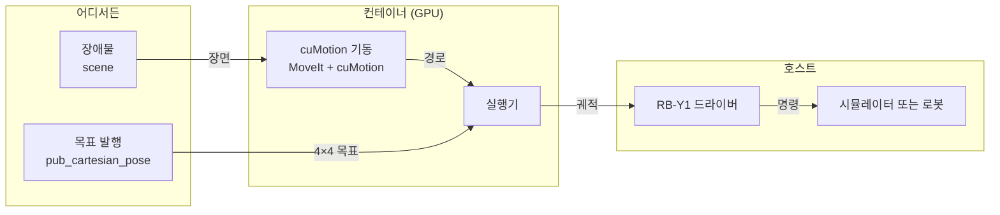
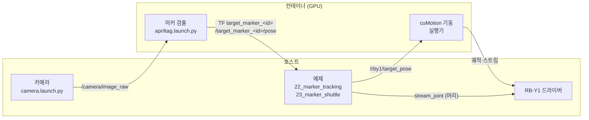

# RB-Y1 cuMotion 사용 가이드

NVIDIA cuMotion으로 RB-Y1의 팔을 움직입니다. 목표 자세(4×4 행렬)를 토픽으로 보내면 GPU가 장애물을 피하는
경로를 계획하고, RB-Y1 드라이버를 통해 로봇이 그 경로대로 움직입니다. 움직이는 도중에 장애물이 경로에 나타나면 멈추지 않고
돌아서 가고, 움직이는 장애물이면 멈춰서 지나가길 기다린 뒤 이어 갑니다. 시뮬레이터와 실제 로봇은 같은 방법으로 씁니다.


```mermaid
flowchart LR
    subgraph host["호스트"]
        robot["시뮬레이터 또는 로봇"]
        driver["RB-Y1 드라이버"]
    end
    subgraph container["컨테이너 (GPU)"]
        planner["cuMotion 기동<br/>MoveIt + cuMotion"]
        executor["실행기"]
    end
    subgraph anywhere["어디서든"]
        target["목표 발행<br/>pub_cartesian_pose"]
        scene["장애물<br/>scene"]
    end
    driver -->|명령| robot
    planner -->|경로| executor
    executor -->|궤적| driver
    target -->|4×4 목표| executor
    scene -->|장면| planner
```

**위에서 아래로 순서대로 따라 하면 됩니다.** 문제가 생기면 그 터미널에 나오는 메시지가 원인과 할 일을 알려 줍니다.
더 자세한 원인은 [developer_manual.md의 트러블슈팅](developer_manual.md#12-트러블슈팅)에 있습니다.

> ⚠️ 시뮬레이터에서 확인한 절차입니다. 실제 로봇에서는 아직 돌려 보지 않았습니다(§4.3 참고).

### 한눈에 보기

```bash
# 터미널1 : 호스트
ros2 launch rby1_driver rby1_ros2_driver.launch.py                  # 드라이버
# 터미널2 : 자세초기화
ros2 run rby1_examples 06_zero_pose                                 # 전원·서보 + 영점
# 터미널3 : 컨테이너 (isaac-ros)
ros2 launch rby1_cumotion demo.launch.py                            # cuMotion 기동: 준비 → 계획 → 목표를 받으면 움직임
# 어디서든
ros2 run rby1_examples 15_moveit_move_hand                          # 예제 (§4 표)
```

---

## 1. 준비물

| 항목 | 값 |
|---|---|
| OS / ROS | Ubuntu 22.04(Humble),Ubuntu 24.04(Jazzy)|
| GPU | NVIDIA, 메모리 12 GB 이상 권장 |
| 환경 | [env_setup_ubuntu_22_04.md](env_setup_ubuntu_22_04.md), 혹은 [env_setup_ubuntu_24_04.md](env_setup_ubuntu_24_04.md)를 끝낸 상태 (GPU 드라이버, Docker, `isaac-ros` 명령) |
| 드라이버 | `~/ros2_driver_ws`가 빌드된 상태 (드라이버 저장소 README) |

```
~/isaac_ros_ws/src/isaac_ros_common      NVIDIA 공식 (release-3.2)
~/isaac_ros_ws/src/rby1_isaac_ros        이 저장소
~/ros2_driver_ws/src/rby1_ros2           RB-Y1 ROS 2 드라이버
~/sdk/rby1-sdk                           RB-Y1 SDK
```

> 호스트와 컨테이너의 `ROS_DOMAIN_ID`가 같아야 합니다(둘 다 설정하지 않았다면 이미 같습니다).

---

## 2. 설치 (처음 한 번)

### 2.1. 이미지 만들기 — 호스트

```bash
cd ~/isaac_ros_ws/src/rby1_isaac_ros/docker
./make_bundles.sh                    # 로봇 모델 파일 준비 (이미지에 들어갑니다)

cp ~/isaac_ros_ws/src/rby1_isaac_ros/docker/isaac_ros_common-config ~/.isaac_ros_common-config
cd ~/isaac_ros_ws/src/isaac_ros_common/scripts
./run_dev.sh -d ~/isaac_ros_ws       # 이미지를 만들고 컨테이너에 들어갑니다
```

첫 빌드는 수십 분 걸립니다. 끝나면 프롬프트가 `admin@…:/workspaces/isaac_ros-dev$`로 바뀝니다.

### 2.2. cuMotion 패키지 빌드 — 컨테이너

```bash
cd /workspaces/isaac_ros-dev
colcon build --base-paths src/rby1_isaac_ros/rby1_cumotion \
    --packages-select rby1_cumotion --symlink-install
```

이후 컨테이너에 들어올 때마다 자동으로 source됩니다.

---

## 3. 실행 (매번)

터미널 네 개를 씁니다.

| 터미널 | 위치 | 하는 일 |
|---|---|---|
| 1 | 호스트 | 시뮬레이터 (실제 로봇이면 필요 없음) |
| 2 | 호스트 | 드라이버 |
| 3 | 컨테이너 | cuMotion 기동 — 이 터미널의 프로그램이 로봇을 움직입니다 |
| 4 | 호스트 | 목표 보내기, 장애물 넣기 |

호스트 터미널에서는 먼저 `source ~/ros2_driver_ws/install/setup.bash`를 합니다.

### 3.1. 시뮬레이터 — 터미널 1

```bash
xhost +local:root
docker run --rm -it -e DISPLAY=$DISPLAY -v /tmp/.X11-unix:/tmp/.X11-unix \
    -p 50051:50051 rainbowroboticsofficial/rby1-sim:0.10.6-m_v1.2
```

로봇 기종에 맞는 태그를 고르십시오. 시뮬레이터 창이 떠야 합니다.

### 3.2. 드라이버 — 터미널 2

```bash
ros2 launch rby1_driver rby1_ros2_driver.launch.py
```

접속 대상은 `rby1_driver/config/driver_parameters.yaml`의 `robot_ip`입니다(기본 `127.0.0.1:50051` = 시뮬레이터).
실제 로봇이면 로봇 주소로 바꿉니다. 다른 설정은 바꾸지 않습니다.

확인 (터미널 4):

```bash
ros2 topic echo /rby1/robot_state --once --field robot_version     # 예: 1.2
```

### 3.3. 시작 자세 — 터미널 3

```bash
ros2 run rby1_examples 06_zero_pose        # 전원·서보를 켜고 모든 관절을 0으로
```

§4의 예제 좌표가 맞도록 영점에서 시작합니다. 계획할 팔은 3.5가 **준비 자세**(팔꿈치 90° 굽혀 앞으로 내민 자세)로
옮기고, 예제 좌표는 그 자세 기준입니다. 다른 자세에서 시작해도 동작하지만 좌표는 자세에 맞게 바꿔야 합니다.

> 왜 준비 자세인가: 팔을 곧게 편 영점에서는 같은 손 위치를 만드는 팔 모양이 여러 가지라, 손을 옮겼다 되돌려도
> **팔이 비틀린 모양으로** 돌아올 수 있습니다(손 위치는 맞음). 그래서 기동할 때 팔꿈치가 펴진 팔을 먼저 굽힙니다.

> ⚠️ cuMotion은 기동할 때의 자세를 기억합니다. 기동한 뒤에 계획하는 팔 이외의 관절(반대팔·몸통)을
> 움직이면 3.5를 다시 켜야 합니다. 머리는 예외입니다(움직여도 됨).

### 3.4. 컨테이너 켜기·들어가기 — 터미널 4

```bash
isaac-ros
```

컨테이너가 꺼져 있으면 켜고 들어가고, 켜져 있으면 그 컨테이너에 추가로 들어갑니다.
프롬프트가 `admin@…:/workspaces/isaac_ros-dev$`이면 됩니다. `root@…`이면 드라이버 토픽을 받지 못하니 나가서 `isaac-ros`로
다시 들어가십시오(`isaac-ros`가 root로 들어가면 [env_setup 8.2](env_setup_ubuntu_22_04.md)대로 고칩니다).

`isaac-ros`를 등록하지 않았다면([env_setup 8.2](env_setup_ubuntu_22_04.md)) 참고

> ⚠️ 컨테이너는 **처음 켠 터미널을 닫으면 삭제**됩니다. 작업이 끝날 때까지 그 터미널을 닫지 마십시오.

### 3.5. cuMotion 기동 — 터미널 4 (컨테이너)

```bash
ros2 launch rby1_cumotion demo.launch.py          # RViz 포함
ros2 launch rby1_cumotion cumotion.launch.py      # 창 없이
```

이 한 줄이 순서대로 합니다: 로봇 확인(기종·버전, 비상정지, 고장) → 전원·서보 → 펴진 팔을 준비 자세로(**로봇이 움직입니다**)
→ 자세 기억 → cuMotion과 실행기 기동. 기본으로 **오른팔**을 계획합니다. 마지막에 `READY`가 나오면 됩니다(1분 안팎):

```
[prepare-1] power and servos on
[prepare-1] right_arm straight (elbow near 0 rad): moving to the ready pose
[prepare-1] right_arm at the ready pose
[prepare-1] PREPARED model=m_1_2 group=right_arm posture=measured hardware=driver ...
[cumotion_planner] cuMotion is ready for planning queries!
[target_executor] waiting for 4x4 targets on /rby1/target_pose (group=right_arm, tool=ee_right, frame=base)
[target_executor] READY
```

**이 런치가 떠 있는 동안 목표를 받으면 로봇이 움직입니다.** 준비 단계가 실패하면 `PREPARE_FAILED: <이유>`를 내고
아무것도 켜지 않은 채 끝납니다.

> 기동 로그의 `No 3D sensor plugin(s) defined for octomap updates` ERROR는 정상입니다.

설정(속도, 그룹 등)은 [6. 설정](#6-설정)에 있습니다.

(선택) 로봇을 움직이지 않고 계획만 확인하려면, 컨테이너 터미널을 하나 더 열어(`isaac-ros`):

```bash
ros2 run rby1_cumotion check_plan
```

---

## 4. 예제 — 터미널 3 (호스트)

예제는 `rby1_examples`의 번호 붙은 노드입니다. 각 예제는 오른팔을 준비 자세 관절로 맞춘 뒤(이미 맞으면 건너뜀), 목표와
장애물을 차례로 보내고, 단계마다 기대한 결과와 실제 결과를 출력합니다. 끝나면 `EXAMPLE_DONE`, 기대와 다르면
`EXAMPLE_FAILED: <단계와 이유>`가 나옵니다. 넣은 장애물은 성공·실패와 상관없이 치웁니다.

```bash
ros2 run rby1_examples 15_moveit_move_hand
```

| 예제 | 하는 일 | 볼 것 (터미널 3·4) |
|---|---|---|
| `15_moveit_move_hand` | 손을 앞으로 5 cm, 위로 5 cm(방향 그대로) 옮겼다 되돌리기 | `EXECUTING …`, `DONE` 두 번 |
| `16_moveit_move_to_pose` | 4×4 절대 자세 두 개: 준비 자세 손에서 앞·위 5 cm, 다시 준비 자세 손 | `DONE` 두 번 |
| `17_moveit_blocked_target` | 손을 15 cm 앞으로 보내는데 손목이 갈 자리에 상자 → 움직이지 않음. 상자를 치우면 감 | `FAILED: planning failed …`, 그다음 `DONE` |
| `18_moveit_box_on_the_way` | 35 cm 올라가는 도중 경로 위에 상자가 나타남 → 멈추지 않고 돌아감 | `AVOIDING replanned …`, `DONE` |
| `19_moveit_approaching_box` | 올라가는 동안 상자가 옆에서 0.1 m/s로 가로질러 옴 → 멈춰 기다렸다 원래 경로로 | `WAITING …`, `RESUMING on the path …` |
| `20_moveit_box_stops_on_the_path` | 같은 상자가 경로 위에서 멈춤 → 기다리다 돌아가는 경로로 | `WAITING …`, `RESUMING around the obstacle …` |
| `21_moveit_new_target` | 30 cm 올라가는 도중 1초 만에 새 목표(처음 자리에서 앞으로 15 cm)가 옴 → 멈추지 않고 새 목표로 | `REPLACED …`, `EXECUTING toward the new target …`, `DONE` |
| `22_marker_tracking` | 카메라가 본 마커를 손(또는 머리)이 따라감 — 카메라·마커 검출 필요, §4.7 | `hand: marker … seen: following`, `TRACKING …` |
| `23_marker_shuttle` | 두 마커의 10 cm 아래 지점 사이를 왕복, 장애물이 있으면 피해서 — §4.7 | 구간마다 `DONE` |
| `24_marker_cartesian_stream` | 비교용: cuMotion 없이 드라이버의 카테시안 스트림만으로 손이 마커를 따라감 — §4.7 ⑤ | `marker seen: following`, 5초마다 명령·거절 수와 마커 좌표 흔들림 |

18~21은 팔이 천천히 움직여야 상자(새 목표)가 도중에 들어올 시간이 있습니다. **이동 시간을 먼저 고정하고** 실행한 뒤 되돌립니다:

```bash
ros2 param set /rby1_target_executor duration 6.0     # 18
ros2 run rby1_examples 18_moveit_box_on_the_way
ros2 param set /rby1_target_executor duration 5.0     # 19, 20
ros2 run rby1_examples 19_moveit_approaching_box
ros2 run rby1_examples 20_moveit_box_stops_on_the_path
ros2 param set /rby1_target_executor duration 4.0     # 21
ros2 run rby1_examples 21_moveit_new_target
ros2 param set /rby1_target_executor duration 0.0     # 원래대로
```

각 예제가 무엇을 하는지는 파일 맨 위 설명에 있습니다(`rby1_examples/rby1_examples/NN_moveit_*.py`). RViz(`demo.launch.py`)에서
장애물이 나타나고 움직이는 것이 보입니다.

`19_moveit_approaching_box`의 출력 예:

```
[1] box probe at [0.29, -0.67, 1.32], 6 cm
[2] probe will slide at [0.0, 0.1, 0.0] m/s for 7 s once the arm moves
[3] 35 cm up while a box crosses in front (look for WAITING, RESUMING on the path) -- expect DONE
      EXECUTING planner_time=0.086s duration=5.00s (duration) steps=101 peak_velocity=13%
      WAITING for a moving obstacle (probe) to pass; braking over 0.30s and backing 0.25s along the path
      RESUMING on the path after waiting 1.8s
      -> DONE
[4] remove probe
[5] back -- expect DONE
      -> DONE
EXAMPLE_DONE
```

- `AVOIDING`: 서 있는 장애물 — 새 경로로 바꿔 타고 멈추지 않습니다.
- `WAITING`: 움직이는 장애물 — 경로 위에서 멈춥니다. 멈출 자리도 장애물이 지나갈 길이면 왔던 경로를 따라 조금 물러납니다.
- `RESUMING on the path`: 길이 비면 원래 경로대로, `RESUMING around the obstacle`: 장애물이 멈췄으면 돌아서 갑니다.
- 멈춘 채 2초(`avoid.wait_before_replan`) 넘게 막혀 있으면 그 자리에서 새 길을 계획합니다(`RESUMING along a new path (1 of at most 3)`).
  한 목표에 3번(`avoid.max_replans`)까지입니다.
- `REPLACED`: 움직이는 중에 새 목표가 오면 이전 목표를 버리고, 팔이 가던 위치·속도에서 새 목표로 다시 계획해 멈추지 않고 갑니다.
  빠르게 움직이는 중이라 그 자리에서 길을 못 찾으면 경로 위에서 멈춘 뒤 서 있는 자세에서 계획합니다(`WAITING: no path to the
  new target …`). 가장 최근 목표만 따릅니다.
- 피하거나 기다리지 못하면(장애물이 팔 바로 앞에 나타남, 목표가 막힘, 팔 쪽으로 옴, 새 길을 3번 만들어도 막힘) 그 자리에 멈추고
  `FAILED: <이유와 할 일>`이 나옵니다.

> ⚠️ **cuMotion의 팔 모델은 손 끝 프레임(`ee_right`·`ee_left`)에서 끝납니다.** 그 앞의 그리퍼는 따로 붙여 줘야 cuMotion이
> 피해 갑니다 — 호스트에서 `ros2 launch rby1_moveit_objects objects.launch.py config:=gripper.yaml` (아래 **그리퍼** 참고).
> 바퀴도 cuMotion은 보지 않습니다.
> 머리는 어느 쪽을 보든 덮는 구 하나(반지름 약 10 cm)로 봅니다. 그래서 머리 추적으로 머리가 움직여도 계획에는 지장이 없습니다.
>
> ⚠️ 장애물을 팔에 너무 붙여 두면(수 cm) 지금 자세가 이미 충돌로 판정돼 **모든 목표가 거부**됩니다.
>
> ⚠️ 로봇 링크에 **붙인** 물체(드라이버 저장소 `rby1_moveit_objects`의 `attach: true`)는 계획하는 팔의 **손 끝에 붙은 것**만
> cuMotion이 봅니다(손에 쥔 공구, 그리퍼 모듈). 머리에 붙인 카메라는 머리 덮개 구가 대신하고, 반대팔 등 다른 곳에 붙인 것은 보지
> 않습니다. 실행기 로그의 `attached module …` 줄이 어느 쪽인지 알려 줍니다.

**그리퍼 — 손 끝에 달린 것 알려 주기**

cuMotion 기동 뒤 호스트에서 그리퍼 모듈을 붙입니다(떠 있는 동안 유지, Ctrl+C로 떼어짐).

```bash
ros2 launch rby1_moveit_objects objects.launch.py config:=gripper.yaml
```

실행기 로그에 `attached module gripper_right_body: on ee_right: 4 spheres`처럼 나오면 반영된 것입니다. 붙이지 않으면 실행기가
`nothing on ee_right is in cuMotion's model …`이라고 경고합니다. 이때도 MoveIt이 자기 로봇 모델(그리퍼 포함)로 경로를 한 번 더
검사해 그리퍼가 닿는 경로는 `FAILED: planning failed: INVALID_MOTION_PLAN …`으로 막지만, 피해서 가지는 않습니다.

물체를 집을 때처럼 **손가락은 닿아도 되게** 하려면 그 부위를 빼 줍니다(실행 중에 바꿀 수 있음).

```bash
ros2 param set /rby1_target_executor free_objects "['gripper_*finger*']"   # 손가락은 무엇과 닿아도 됨
ros2 param set /rby1_target_executor free_objects "['']"                   # 다시 전부 검사
```

이름은 붙인 모듈과 로봇 링크 양쪽에 맞춰지고(`*` 사용 가능), cuMotion과 MoveIt 둘 다에 적용됩니다. 다른 툴을 달았다면
`gripper.yaml`을 복사해 고쳐 씁니다(형식은 드라이버 저장소 `rby1_moveit_objects/README.md`). 예전처럼 손목과 그리퍼를 한 덩어리
(손 주변 약 14 cm)로 보게 하려면 설정 파일의 `robot.body_ends_at_tool`을 `false`로 둡니다.

> 예제는 목표를 `/rby1/target_pose`로 보내고 결과를 `/rby1/target_status`에서 받으므로, cuMotion 대신 드라이버 저장소의
> 일반 MoveIt(OMPL) 실행기(`rby1_moveit_executor`, 드라이버 저장소 README의 **Additional Tools**)가 떠 있으면 그대로 그쪽으로
> 갑니다. 18~21은 움직이는 중에 경로를 살피는 cuMotion에서만 되고, MoveIt 실행기에서는 그렇다고 알리고 끝납니다.

### 4.1. 목표를 직접 보내기

예제 없이 목표 하나를 보낼 때는 `pub_cartesian_pose`를 씁니다(파라미터 전체는 드라이버 저장소 README의 **Additional Tools**).

```bash
ros2 run rby1_examples pub_cartesian_pose --ros-args -p "offset_xyz:=[0.05,0.0,0.05]"      # 지금 손에서 앞·위 5 cm
ros2 run rby1_examples pub_cartesian_pose --ros-args \
    -p "matrix:=[0.0012,-0.0001,-1.0,0.4131, 0.4792,0.8777,0.0004,-0.3674, 0.8777,-0.4792,0.0011,1.1161, 0.0,0.0,0.0,1.0]"   # 준비 자세 손
```

`offset_xyz`는 `base` 좌표계(x 앞, y 왼쪽, z 위, 미터)입니다. `matrix`는 16개 값을 행 순서로, **모든 값을 소수로** 씁니다
(`1` 대신 `1.0`). 지금 손 자세는 드라이버에 물으면 나옵니다:

```bash
ros2 service call /rby1/get_cartesian_pose rby1_msgs/srv/GetCartesianPose "{ref_link: base, target_link: ee_right}"
```

cuMotion은 **손의 위치·방향만** 목표로 받고 팔 모양(팔꿈치 위치 등)은 스스로 고르므로, 왕복을 반복하면 관절이 조금씩
달라질 수 있습니다. 준비 자세 관절로 정확히 돌아가려면(충돌 회피 없음):

```bash
ros2 action send_goal /rby1/robot_joint rby1_msgs/action/Rby1JointCommand "{right_arm: {position: [0.0,-0.5,0.0,-1.57,0.0,0.0,0.0], minimum_time: 4.0}}"
```

장애물을 직접 넣고 빼는 명령(`rby1_moveit_scene`)도 드라이버 저장소 README의 **Additional Tools**에 있습니다.

### 4.2. 속도 — 속도 제한과 최소 시간

한 번 움직이는 시간은 경로마다 정해집니다. 손의 **선속도**·**각속도** 제한과 관절 속도 한계를 넘지 않는 가장 짧은
시간을 쓰되, **최소 시간**보다 짧게는 하지 않습니다. 실행 로그의 괄호가 무엇이 시간을 정했는지 보여 줍니다.

| 설정 (`motion`) | 기본값 | 뜻 |
|---|---|---|
| `linear_velocity_limit` | `1.5` m/s | 손의 최고 선속도 |
| `angular_velocity_limit` | `4.712388` rad/s | 손의 최고 회전 속도 |
| `minimum_time` | `2.0` s | 짧은 이동도 이보다 빨리 끝나지 않음 |
| `duration` | `0.0` | 0보다 크면 모든 이동을 정확히 이 시간으로 (위 제한 대신) |

실행 중에 바꾸기(다음 목표부터 적용, 범위를 벗어나면 이유와 함께 거부):

```bash
ros2 param set /rby1_target_executor linear_velocity_limit 0.1
ros2 param set /rby1_target_executor duration 3.0      # 모든 이동을 3 s로 (0이면 다시 제한 기준)
```

기본값 자체를 바꾸려면 설정 파일을 고칩니다(§6). 실제 걸리는 시간은 계산보다 약 15% 깁니다.

### 4.3. 실제 로봇에서

순서는 같습니다. 3.1을 건너뛰고 3.2의 `robot_ip`만 로봇 주소로 바꿉니다. 처음에는 속도 제한을 낮추고(예: `linear_velocity_limit` 0.2, `minimum_time` 5.0), 이동량은
작게 두고, 비상정지 버튼에 손이 닿는 상태에서 시작하십시오. 3.3의 자세 명령은 주변 공간을 확인한 뒤에 보내십시오.

### 4.4. 왼팔, 팔+몸통

cuMotion 기동(3.5) 때 그룹을 고릅니다(설정 파일의 `robot.group`을 바꿔도 됩니다).

```bash
ros2 launch rby1_cumotion demo.launch.py group:=left_arm            # 왼팔
ros2 launch rby1_cumotion demo.launch.py group:=right_arm+torso     # 오른팔 + 몸통
```

예제(§4 표)는 오른팔 기준입니다. 왼팔 목표는 `target_link:=ee_left`로 보냅니다:

```bash
ros2 run rby1_examples pub_cartesian_pose --ros-args -p target_link:=ee_left -p "offset_xyz:=[0.05,0.0,0.05]"
```

### 4.5. 내 프로그램에서 목표 보내기

`pub_cartesian_pose`는 예제일 뿐이고, 같은 ROS 도메인의 어떤 노드든 아래 두 토픽만 쓰면 됩니다.

| 토픽 | 타입 | 내용 |
|---|---|---|
| `/rby1/target_pose` | `std_msgs/Float64MultiArray` | 16개 값, 행 순서 4×4. 계획 그룹 손 프레임(`ee_right`/`ee_left`)의 `base` 기준 자세 |
| `/rby1/target_status` | `std_msgs/String` | `READY` `PLANNING` `EXECUTING …` (`AVOIDING …` `WAITING …` `RESUMING …` `REPLACED …`) `DONE` `FAILED: <이유>` |

움직이는 중에 새 목표가 오면 그것으로 **바꿉니다**(`REPLACED` 다음 `EXECUTING toward the new target`). 쌓아 두지 않고
가장 최근 것만 따릅니다. `DONE`·`FAILED`는 마지막으로 받은 목표의 결과입니다.

### 4.6. 추적 모드 — 움직이는 목표를 계속 따라가기

지금까지는 목표 하나마다 경로 전체를 계획해 움직였습니다(점대점). 목표가 계속 바뀌면(카메라가 보는 마커 등) **추적 모드**로
바꿉니다. 목표가 올 때마다 목표 지점만 바뀌고, 팔은 초당 50번 한 걸음씩 따라갑니다. 장면의 장애물과 손에 붙인 모듈은
추적 중에도 부딪히지 않게 봅니다.

```bash
ros2 service call /rby1_target_executor/set_tracking std_srvs/srv/SetBool "{data: true}"    # 추적 모드
# … /rby1/target_pose로 목표를 계속 보냄 (예: 22_marker_tracking, §4.7 — 이 예제는 추적 모드를 스스로 켜고 끕니다)
ros2 service call /rby1_target_executor/set_tracking std_srvs/srv/SetBool "{data: false}"   # 점대점으로
```

- 켜면 `TRACKING at 50 Hz`, 목표가 0.5초 끊기면 `TRACKING: no target …; holding at the last one`(마지막 목표에서 멈춤),
  끄면 `READY`가 나옵니다.
- 점대점 이동 중에는 켜지지 않습니다(`a move is in progress`). `DONE`을 받은 뒤 켜십시오.
- 움직이는 목표는 조금 앞을 겨눕니다(`tracking.lead` — 로봇이 명령을 약 0.1초 늦게 따라가므로). 카메라 좌표의 떨림은
  걸러 냅니다(`tracking.smoothing`).
- 따라가는 방식은 두 가지입니다(`config/cumotion.yaml`의 `tracking.method`).

| `method` | 방식 | 장애물 | 시뮬레이터 실측 — 손이 제자리에서 벗어난 거리(평균) |
|---|---|---|---|
| `ik` (기본) | 매 걸음 IK를 풀어 바로 따라감 | 앞에서 멈춤(`TRACKING: … holding`) | 정지 0.1 mm, 6 cm/s 1.4 mm, 13 cm/s 7.5 mm, 10 cm 건너뛰면 0.4초 |
| `mpc` | 앞을 내다보는 MPC | 돌아서 감 | 정지 1 mm, 6 cm/s 5 mm, 13 cm/s 28 mm, 10 cm 건너뛰면 1.8초 |

(목표가 반지름 6 cm 원을 돌 때. 마커 좌표에 1 mm 떨림을 넣으면 `ik`는 정지 0.8 mm, 6 cm/s 3.5 mm, 13 cm/s 9 mm.)

- **1 cm 안으로 따라가는 범위는 약 13 cm/s까지**입니다(급하게 방향을 바꾸는 목표 기준). 로봇이 명령을 0.1초 늦게 따라가는
  만큼을 예측으로 메우기 때문에, 빠르게 꺾을수록 예측이 빗나갑니다. 일정한 속도로 곧게 가는 목표는 더 빨라도 따라갑니다.
- 카메라·검출이 늦는 만큼(보통 0.05~0.1초) `lead`를 늘립니다(기본 `0.12`). 손이 목표보다 뒤처지면 늘리고, 앞서면 줄입니다.
- 마커가 가만히 있을 때는 앞서 겨누지 않고 최근 좌표의 평균을 씁니다. "가만히"의 기준은 카메라 좌표의 떨림에 맞춰 스스로
  정해지므로, 좌표가 많이 떨리는 카메라에서는 손이 덜 떨리는 대신 느린 움직임을 조금 늦게 따라갑니다. `ik`·`mpc` 어느 쪽이든
  같습니다(떨림은 방식을 바꿔서 줄어들지 않습니다).
- 그래도 손이 떨리면 `smoothing`을 올립니다(기본 `0.75`, 최대 `0.95`). 올릴수록 방향 전환에 늦게 반응합니다.
- 장애물을 돌아가며 따라가야 하면 `method: mpc`로 바꿉니다(설정 파일을 복사해 고치고 `config:=`로).

```bash
ros2 launch rby1_cumotion cumotion.launch.py config:=/경로/my_cumotion.yaml
```

### 4.7. 카메라가 본 마커로 움직이기 (예제 22, 23)

카메라 영상에서 AprilTag 마커를 찾아, 그 좌표로 로봇을 움직입니다.


```mermaid
flowchart LR
    subgraph host["호스트"]
        camera["카메라<br/>camera.launch.py"]
        example["예제<br/>22_marker_tracking<br/>23_marker_shuttle"]
        driver["RB-Y1 드라이버"]
    end
    subgraph container["컨테이너 (GPU)"]
        apriltag["마커 검출<br/>apriltag.launch.py"]
        cumotion["cuMotion 기동<br/>실행기"]
    end
    camera -->|"/camera/image_raw"| apriltag
    apriltag -->|"TF target_marker_&lt;id&gt;<br/>/target_marker_&lt;id&gt;/pose"| example
    example -->|"/rby1/target_pose"| cumotion
    cumotion -->|궤적·스트림| driver
    example -->|"stream_joint (머리)"| driver
```

cuMotion 기동(3.5)이 `READY`인 상태에서 아래를 차례로 켭니다. 카메라 종류·보정·장착 위치 같은 자세한 내용은
[tutorial_apriltag.md](tutorial_apriltag.md)에 있습니다.

**① 카메라 영상 발행 — 호스트**

```bash
ros2 launch rby1_additional_tools camera.launch.py                    # 웹캠
ros2 launch rby1_additional_tools camera.launch.py camera:=realsense  # RealSense
```

**② 마커 검출 — 컨테이너** (`isaac-ros`로 들어간 새 터미널)

```bash
ros2 launch rby1_apriltag apriltag.launch.py ids:=7,12                # ids: 쓸 마커 번호
```

마커 크기(검은 사각형 한 변)는 `rby1_apriltag/config/target_tags.yaml`의 `size`(기본 0.10 m)입니다. 인쇄한 마커에 맞춰 고치거나
`size:=0.08`처럼 덧붙입니다 — 마커 위치는 이 크기로 계산하므로(깊이 영상은 쓰지 않음) 틀리면 거리가 그만큼 틀립니다.

마커를 카메라 앞에 두고 좌표가 나오는지 봅니다(호스트):

```bash
ros2 run tf2_ros tf2_echo base target_marker_7        # 로봇 기준(base) 마커 위치
```

**③ 예제 1 — 손이 마커를 따라감 (`22_marker_tracking`) — 호스트**

```bash
ros2 run rby1_examples 22_marker_tracking                                # 손이 따라감
ros2 run rby1_examples 22_marker_tracking --ros-args -p follow:=head     # 머리가 따라감 (cuMotion 없이도 됨)
ros2 run rby1_examples 22_marker_tracking --ros-args -p follow:=both     # 손과 머리 둘 다
```

- 손은 마커에서 로봇 쪽으로 20 cm 떨어진 곳(`hand.offset`)을 따라갑니다. 손 방향은 시작할 때 그대로입니다.
  시뮬레이터에서 정지한 마커에는 1 mm 안, 6 cm/s로 도는 마커에는 평균 1.4 mm(마커 좌표에 1 mm 떨림이 있으면 3.5 mm)로
  따라갔습니다(§4.6 표).
- 예제가 추적 모드(§4.6)를 스스로 켜고, Ctrl+C로 끝내면 끕니다.
- 마커를 놓치면 손은 마지막 자리에서 멈추고, 머리는 3초 뒤 정면으로 돌아갑니다. 다시 보이면 이어 갑니다.
- 카메라가 머리에 달려 있으면 `follow:=both`로 머리가 마커를 계속 화면에 두게 할 수 있습니다.

```
hand: tracking: targets on /rby1/target_pose move the goal, followed at 50 Hz
hand: marker target_marker_7 seen: following
head: marker found 0.36 m away: tracking
```

| 파라미터 (`--ros-args -p 이름:=값`) | 기본값 | 뜻 |
|---|---|---|
| `follow` | `hand` | `hand` \| `head` \| `both` |
| `marker_id` | `7` | 따라갈 마커 번호 |
| `hand.offset` | `[-0.2, 0.0, 0.0]` m | 마커에서 손이 갈 곳까지 (`base` 방향) |
| `hand.follow_orientation` | `false` | `true`면 손이 마커 방향을 따라 돎 |
| `hand.workspace_min`, `hand.workspace_max` | `[0.2, -0.8, 0.6]`, `[0.8, 0.4, 1.6]` m | 목표를 이 상자 안으로 자름 |
| `head.gain`, `head.max_speed` | `0.6`, `0.8` rad/s | 머리가 따라가는 세기와 최고 속도 |

나머지 파라미터는 예제 파일 맨 위 설명에 있습니다.

**④ 예제 2 — 두 마커 사이 왕복 (`23_marker_shuttle`) — 호스트**

두 마커가 모두 카메라에 보이게 둡니다. 손이 각 마커의 10 cm 아래(`base`의 z로 −10 cm) 지점을 오갑니다.

```bash
ros2 run rby1_examples 23_marker_shuttle                                           # 마커 7, 12 사이를 3번 왕복
ros2 run rby1_examples 23_marker_shuttle --ros-args -p "marker_ids:=[3, 5]" -p cycles:=5
```

구간마다 경로를 계획하므로, 장면에 장애물을 넣으면 **피해서** 오갑니다. 왕복 중에 다른 터미널에서 넣어 봅니다(좌표는 두 지점
사이로):

```bash
ros2 run rby1_moveit_scene scene add box wall --xyz 0.45 -0.28 1.15 --size 0.06 0.06 0.06
ros2 run rby1_moveit_scene scene remove wall
```

`box:=true`를 주면 예제가 첫 왕복 뒤 두 지점 한가운데에 6 cm 상자를 넣고 끝날 때 치웁니다.

```
[1] looking for markers 7 and 12
      target_marker_7 at [0.45, -0.45, 1.25] m in base
[2] round 1/3: [0.0, 0.0, -0.1] m from marker 7, [0.45, -0.45, 1.15] -- expect DONE
      -> DONE
      hand is 0.1 mm from the point
[4] box shuttle_box at [0.45, -0.275, 1.15], 6 cm
EXAMPLE_DONE
```

| 파라미터 | 기본값 | 뜻 |
|---|---|---|
| `marker_ids` | `[7, 12]` | 오갈 두 마커 (②의 `ids`에 둘 다 있어야 함) |
| `offset` | `[0.0, 0.0, -0.10]` m | 마커에서 손이 갈 지점까지 (`base` 방향) |
| `cycles` | `3` | 왕복 횟수 |
| `box` | `false` | `true`면 첫 왕복 뒤 두 지점 사이에 상자를 넣음 |
| `tolerance` | `0.005` m | 구간 끝에서 손이 지점에서 이보다 멀면 실패로 끝냄 |

- 구간이 끝날 때마다 손이 지점에서 얼마나 떨어졌는지 출력합니다(시뮬레이터 0.0~0.6 mm).
- 마커 위치는 구간마다 다시 읽습니다. 팔에 가려 안 보이면 마지막으로 본 위치를 씁니다.
- 지점이 닿지 않는 곳이거나 장애물에 막혀 있으면 `EXAMPLE_FAILED: … FAILED: <이유>`로 끝납니다.

**⑤ 비교용 — cuMotion 없이 드라이버만으로 따라가기 (`24_marker_cartesian_stream`) — 호스트**

손이 떨리거나 늦게 따라올 때, 그것이 cuMotion 쪽 문제인지 카메라 좌표 쪽 문제인지 가려 보는 예제입니다. 목표를 드라이버의
`stream_cartesian`(드라이버가 IK를 풀어 관절 스트림으로 보냄)으로 바로 보냅니다. **③의 예제와 동시에 켜지 않습니다.**

```bash
ros2 run rby1_examples 24_marker_cartesian_stream
ros2 run rby1_examples 24_marker_cartesian_stream --ros-args -p smoothing:=0.0     # 마커 좌표를 거르지 않고 그대로
```

- 5초마다 보낸 명령 수, 거절된 수, 그리고 **마커 좌표 자체가 흔들린 폭**(x·y·z, mm)을 출력합니다. 마커를 가만히 둔 상태에서 이
  값이 크면(수 mm 이상) 손 떨림은 카메라 좌표에서 오는 것입니다.
- 장애물을 보지 않고, 앞서 겨누지도 않습니다. 그래서 움직이는 마커를 약 0.3초 늦게 따라가고(시뮬레이터: 6 cm/s에서 2 cm,
  13 cm/s에서 4 cm), 정지한 마커에는 1 mm 안으로 갑니다.

| 손이 떨릴 때 | 볼 것·할 것 |
|---|---|
| ⑤에서도 떨림 | 마커 좌표가 흔들리는 것: 조명·초점, 마커를 크게·가깝게, `target_tags.yaml`의 `window_size` 올리기, 카메라 보정 |
| ③(cuMotion)에서만 떨림 | 앞서 겨누기가 좌표 떨림을 키우는 것: `tracking.smoothing`을 올리고(0.85~0.9), `tracking.lead`를 줄임(0이면 앞서 겨누지 않음). `method`를 `mpc`로 바꾸는 것은 도움이 되지 않습니다 |

---

## 5. 종료

터미널 3(cuMotion) → 2(드라이버) → 1(시뮬레이터) 순서로 Ctrl+C.

> ⚠️ 컨테이너는 처음 연 터미널(`run_dev.sh`)을 닫으면 **삭제**됩니다. 워크스페이스(`/workspaces/isaac_ros-dev`) 밖에 둔 파일은 남지 않습니다.
> 다음에는 3.4처럼 `isaac-ros`로 다시 들어갑니다(이미지는 다시 만들지 않습니다).

---

## 6. 설정

모든 기본값은 설정 파일 하나에 있습니다: `rby1_cumotion/config/cumotion.yaml`(설치본:
`install/rby1_cumotion/share/rby1_cumotion/config/cumotion.yaml`). 기동할 때 전부 검사하므로 모르는 이름이나
범위를 벗어난 값이 있으면 이유를 말하고 멈춥니다.

| 구역 | 주요 설정 | 기본값 |
|---|---|---|
| `robot` | `group` — 계획할 팔 | `right_arm` (`left_arm` `right_arm+torso` `left_arm+torso`) |
| | `enable_robot` — 기동 시 전원·서보 | `true` |
| | `ready_if_straight` — 펴진 팔을 준비 자세로 | `true` |
| `robot` | `body_ends_at_tool` — 계획하는 팔의 모델을 손 끝 프레임에서 끊음(그리퍼는 모듈로) | `true` |
| | `free_objects` — 무엇과 닿아도 되는 모듈·링크 이름 | `[]` |
| `motion` | `linear_velocity_limit`, `angular_velocity_limit`, `minimum_time`, `duration` | §4.2 |
| `impedance` | `enabled` — 궤적을 관절 임피던스로(부딪히면 팔이 밀림) | `false` |
| | `stiffness`, `damping_ratio`, `torque_limit` | `500` N·m/rad, `1.0`, `50` N·m |
| `tracking` | `method` — 따라가는 방식 `ik` \| `mpc` (§4.6) | `ik` |
| | `rate` — 추적 모드의 제어 주기 | `50` Hz |
| | `max_speed`, `max_acceleration` — `ik`의 관절 속도·가속도 한계 | `2.0` rad/s, `10.0` rad/s² |
| | `stale_after` — 목표가 이만큼 끊기면 마지막 목표에서 멈춤 | `0.5` s |
| | `lead`, `lead_max` — 움직이는 목표를 앞서 겨누는 시간·거리 | `0.12` s, `0.1` m |
| | `smoothing` — 목표 좌표의 떨림을 거르는 정도(0~0.95) | `0.75` |
| `avoid` | `enabled` — 움직이는 중 장애물 피하기 | `true` |
| | `wait_before_replan` — 멈춘 채 막혀 있으면 이만큼 뒤 새 길 계획 | `2.0` s |
| | `max_replans` — 한 목표에 새 길을 만드는 최대 횟수 | `3` |
| | `give_up_after` — 멈추지 않고 이 시간 넘게 피하면 `FAILED` | `5.0` s |
| `planner` | cuMotion 계획·IK 설정 | [developer_manual.md](developer_manual.md#7-플래너-설정) |

바꾸는 방법:

```bash
# 한 번만: 기동 인자로
ros2 launch rby1_cumotion demo.launch.py group:=left_arm
# 다른 설정 파일로
ros2 launch rby1_cumotion demo.launch.py config:=/경로/my_cumotion.yaml
# 실행 중에 (motion·impedance 구역)
ros2 param set /rby1_target_executor minimum_time 3.0
ros2 param set /rby1_target_executor impedance.enabled true
```

`pub_cartesian_pose`의 파라미터는 드라이버 저장소 README의 **Additional Tools**에 있습니다.

---

## 참고

- [developer_manual.md](developer_manual.md) — 구조, 번들, 이미지, 충돌 모델, 설정, 테스트, [트러블슈팅](developer_manual.md#12-트러블슈팅)
- 드라이버 저장소 README (`~/ros2_driver_ws/src/rby1_ros2/README.md`) — 드라이버 빌드·설정, **Additional Tools**(`rby1_moveit_scene`, `pub_cartesian_pose`)
- [env_setup_ubuntu_22_04.md](env_setup_ubuntu_22_04.md) — GPU·Docker 환경, `isaac-ros` 명령
- [NVIDIA cuMotion MoveIt (release-3.2)](https://nvidia-isaac-ros.github.io/v/release-3.2/repositories_and_packages/isaac_ros_cumotion/isaac_ros_cumotion_moveit/index.html)
- [RB-Y1 시뮬레이터 이미지](https://hub.docker.com/r/rainbowroboticsofficial/rby1-sim)
